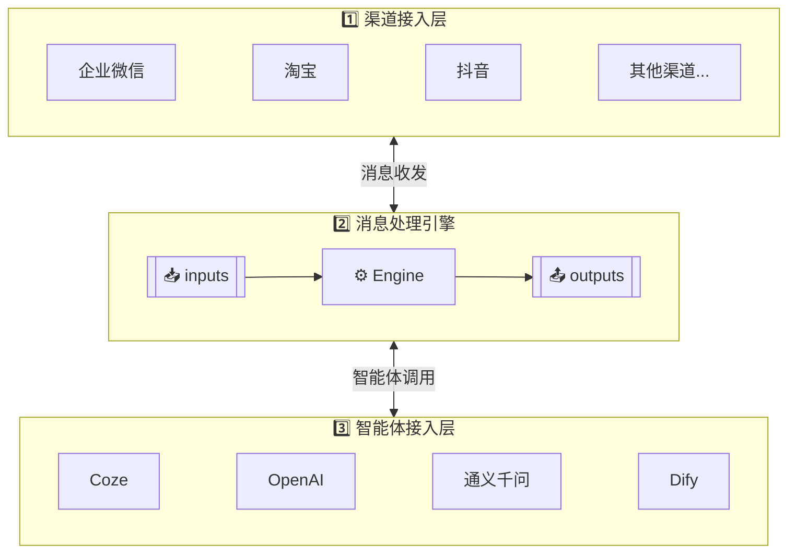

# 汇智答 (HuiZhiDa) - 智能客服平台

## 📖 项目简介

**汇智答** 是一个统一的智能客服中枢平台，旨在帮助企业对接多个主流客服平台（企业微信、淘宝、抖音等），通过 AI 智能体实现智能自动回复，提升客服效率。

### 核心特性

*   🚀 **统一接入**：支持企业微信、淘宝、抖音等多个主流客服渠道
*   🤖 **智能处理**：集成多种 AI 智能体平台（Coze、Dify、元器 等）
*   🔌 **插件化架构**：基于适配器模式，易于扩展新渠道和智能体
*   👥 **人机协作**：支持智能体与人工客服无缝切换
*   📊 **可视化管理**：基于 Filament 构建的管理后台
*   ⚡ **高性能**：双队列驱动，支持高并发消息处理

## 🏗️ 系统架构

系统采用 **三层架构 + 双队列驱动** 模式，通过 `inputs` 和 `outputs` 两个消息队列实现层与层之间的解耦：

### 层级职责

| 层级                  | 核心职责                                                                          |
| ------------------- | ----------------------------------------------------------------------------- |
| **渠道接入层 (Channel)** | 对接各客服渠道（企业微信、淘宝、抖音等），负责渠道回调接收、签名验证、消息格式转换、消息入队 (inputs)、消费输出队列 (outputs)、消息发送 |
| **消息处理引擎 (Engine)** | 核心处理层，消费 inputs 队列、事件处理、规则预校验、调用智能体、回复预处理、发布到 outputs 队列                      |
| **智能体接入层 (Agent)**  | 对接各 AI 平台（OpenAI、通义千问、Coze、Dify 等），提供统一的智能体适配器接口                              |
| **管理端 (Admin)**     | 应用管理、渠道配置、智能体配置、数据统计、系统监控                                                     |

### 双队列说明

| 队列        | 方向        | 作用              |
| --------- | --------- | --------------- |
| `inputs`  | 渠道层 → 引擎层 | 传递用户输入消息，触发消息处理 |
| `outputs` | 引擎层 → 渠道层 | 传递智能体回复，触发消息发送  |

## 🛠️ 技术栈

系统通过消息队列解耦各层，**支持按需拆分为独立服务，使用不同技术栈实现**：

| 层级         | 当前实现                   | 可选方案             | 说明                            |
| ---------- | ---------------------- | ---------------- | ----------------------------- |
| **渠道接入层**  | PHP Laravel            | Go (Gin/Fiber)   | 高并发场景下可使用 Go 处理大量渠道回调         |
| **消息处理引擎** | PHP Laravel            | Python (FastAPI) | 可使用 Python 接入本地大模型，实现智能预校验和分流 |
| **智能体接入层** | PHP Laravel            | Python           | 本地模型推理场景可使用 Python 生态         |
| **管理端**    | PHP Laravel + Filament | -                | 管理后台，保持 PHP 实现                |

### 基础设施

*   **消息队列**: Redis Streams / Redis List / RabbitMQ
*   **数据库**: MySQL 8.0
*   **缓存**: Redis

### 支持的智能体平台

| 平台       | 状态     | 说明             |
|----------| ------ | -------------- |
| **Coze** | ✅ 已实现  | 字节跳动智能体平台      |
| **Dify** | 🚧 规划中 | 开源 LLM 应用平台    |

### 支持的客服渠道

| 渠道          | 状态     | 说明           |
| ----------- | ------ | ------------ |
| **企业微信客服**  | ✅ 已实现  | 企业微信客服 API   |
| **自定义 API** | ✅ 已实现  | Webhook 回调方式 |
| **淘宝/天猫客服** | 🚧 规划中 | 淘宝开放平台       |
| **抖音客服**    | 🚧 规划中 | 抖音开放平台       |

### 防抖机制

系统支持消息防抖，聚合同一会话的连续消息后统一处理，避免重复调用智能体：

*   消息发布时设置延时（如 3 秒）
*   只有最后一条消息会触发实际处理
*   通过 Redis 记录最后事件 ID 实现判断

## 🔐 安全特性

*   HTTPS 加密传输
*   敏感数据加密存储（API 密钥等）
*   基于角色的权限管理
*   渠道回调签名验证

## 📝 API 文档

### 渠道回调接口

    GET  /api/gateway/{channel}/{id}    # 健康检查/URL验证
    POST /api/gateway/{channel}/{id}    # 接收渠道消息回调

*   `{channel}`: 渠道类型，如 `wecom`（企业微信）、`api`（自定义API）等
*   `{id}`: 渠道 ID
*   GET 请求用于渠道验证（如企业微信 URL 验证）
*   POST 请求接收渠道消息回调，自动进行签名验证

### 管理后台

基于 Filament 构建，提供以下功能：

*   **智能体管理**: 创建、编辑、删除智能体配置
*   **渠道管理**: 配置各渠道接入参数
*   **会话查看**: 查看会话记录和消息详情（规划中）
*   **数据统计**: 消息量、会话量统计（规划中）

## 📚 相关文档

*   [架构文档](docs/architecture.md) - 完整的系统设计文档

**渠道对接**：

*   [企业微信客服 API](https://developer.work.weixin.qq.com/document/path/94638)
*   [淘宝开放平台](https://open.taobao.com/)

**智能体平台**：

*   [Coze 开放平台](https://www.coze.cn/docs/)
*   [OpenAI API](https://platform.openai.com/docs/)
*   [通义千问 API](https://help.aliyun.com/document_detail/2400395.html)
*   [Dify 文档](https://docs.dify.ai/)

如有问题或建议，请提交 Issue 或联系项目维护者。

***

**汇智答** - 汇聚智能，有问必答 🚀
