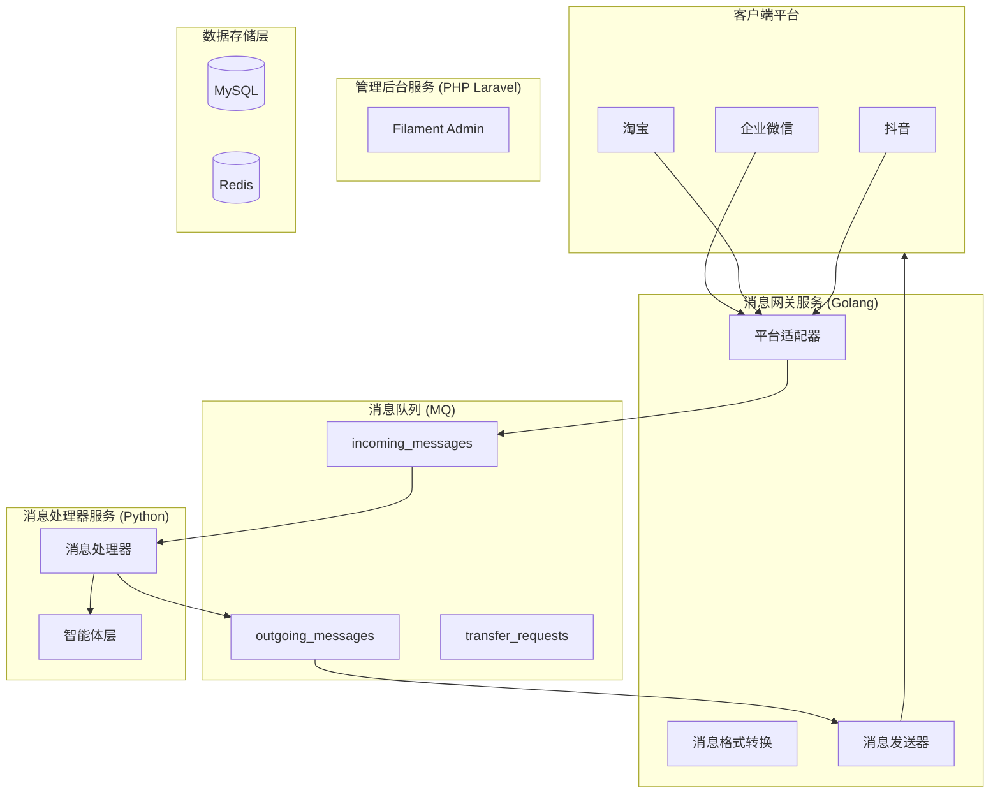

# 汇智答 (HuiZhiDa) - 智能客服平台

> 汇聚智能，有问必答

[](LICENSE)
[](https://go.dev/)
[](https://www.python.org/)
[](https://www.php.net/)

## 📖 项目简介

**汇智答** 是一个统一的智能客服中枢平台，旨在帮助企业对接多个主流客服平台（企业微信、淘宝、抖音等），通过 AI 智能体实现智能自动回复，提升客服效率。

### 核心特性

- 🚀 **统一接入**：支持企业微信、淘宝、抖音等多个主流客服平台
- 🤖 **智能处理**：集成多种 AI 智能体（本地/远程/组合模式）
- 🔌 **插件化架构**：易于扩展新平台和智能体
- 👥 **人机协作**：支持智能体与人工客服无缝切换
- 📊 **可视化管理**：提供完善的管理后台进行配置和监控
- ⚡ **高性能**：支持高并发消息处理，吞吐量 > 1000 msg/s

## 🏗️ 系统架构

系统采用 **三层微服务架构**，将不同职责分离到独立的服务中：



### 服务职责

| 服务 | 技术栈 | 核心职责 |
|------|--------|----------|
| **消息网关** | Golang (Gin/Fiber) | 平台回调接收、签名验证、消息格式转换、消息发送 |
| **消息处理器** | Python (FastAPI) | 消息消费、规则预判断、智能体调用、AI能力集成 |
| **管理后台** | PHP Laravel + Filament | 应用管理、平台配置、智能体配置、数据统计 |

## 🛠️ 技术栈

### 后端服务

- **消息网关**: Go + Gin/Fiber
- **消息处理器**: Python + FastAPI
- **管理后台**: PHP Laravel + Filament

### 基础设施

- **消息队列**: Redis Streams / RabbitMQ / Kafka
- **数据库**: MySQL 8.0
- **缓存**: Redis
- **向量数据库**: Chroma / Milvus (FAQ语义检索)
- **本地模型**: Ollama

### AI 框架

- **LangChain / LlamaIndex**: RAG、对话编排
- **支持的智能体平台**:
  - 本地: Ollama, llama.cpp, vLLM
  - 远程: OpenAI, 通义千问, Coze, Dify

## 🚀 快速开始

### 前置要求

- Docker & Docker Compose
- Go 1.21+ (开发网关服务)
- Python 3.10+ (开发处理器服务)
- PHP 8.2+ (开发管理后台)

### 使用 Docker Compose 启动

```bash
# 克隆项目
git clone https://github.com/your-org/huizhida-chatbot.git
cd huizhida-chatbot

# 启动所有服务
docker-compose up -d

# 查看服务状态
docker-compose ps

# 查看日志
docker-compose logs -f
```

服务启动后：

- 消息网关: http://localhost:8080
- 消息处理器: http://localhost:8081
- 管理后台: http://localhost:8082
- Ollama: http://localhost:11434

### 配置说明

1. **创建应用**: 在管理后台创建应用并绑定智能体
2. **配置渠道**: 为应用添加渠道配置（企业微信、淘宝等）
3. **配置智能体**: 创建本地/远程/组合智能体
4. **设置回调**: 在各平台配置回调地址 `http://your-domain/api/callback/{platform}/{app_id}`

## 📁 项目结构

```
huizhida-chatbot/
├── gateway/                    # 消息网关 (Go)
│   ├── cmd/
│   ├── internal/
│   │   ├── adapter/           # 平台适配器
│   │   ├── handler/           # HTTP处理器
│   │   ├── service/           # 业务服务
│   │   └── queue/             # 队列操作
│   └── go.mod
│
├── processor/                  # 消息处理器 (Python)
│   ├── app/
│   │   ├── main.py            # FastAPI入口
│   │   ├── core/              # 核心处理逻辑
│   │   ├── agent/             # 智能体实现
│   │   └── ai/                # AI能力集成
│   └── requirements.txt
│
├── admin/                      # 管理后台 (Laravel + Filament)
│   ├── app/
│   │   ├── Filament/          # Filament资源
│   │   └── Models/
│   └── composer.json
│
├── docs/                       # 文档
│   └── requirements.md         # 需求文档
│
├── docker-compose.yml          # 开发环境
└── README.md
```

## 🔧 开发指南

### 本地开发

#### 1. 消息网关 (Go)

```bash
cd gateway
go mod download
go run cmd/main.go
```

#### 2. 消息处理器 (Python)

```bash
cd processor
python -m venv venv
source venv/bin/activate  # Windows: venv\Scripts\activate
pip install -r requirements.txt
uvicorn app.main:app --reload --port 8081
```

#### 3. 管理后台 (Laravel)

```bash
cd admin
composer install
cp .env.example .env
php artisan key:generate
php artisan migrate
php artisan serve --port=8082
```

### 添加新平台适配器

1. 在 `gateway/internal/adapter/` 创建新的适配器文件
2. 实现 `PlatformAdapter` 接口
3. 在 `factory.go` 中注册新适配器

### 添加新智能体

1. 在 `processor/app/agent/` 创建新的智能体实现
2. 继承 `IAgentAdapter` 接口
3. 在 `factory.py` 中注册新智能体

## 📊 功能特性

### 智能体类型

- **本地智能体**: 基于 Ollama/llama.cpp 的本地模型
- **远程智能体**: 对接 OpenAI、通义千问等远程 API
- **组合智能体**: 本地分类 + 远程处理，智能路由

### 转人工机制

- **规则预判断**: 关键词匹配、VIP策略等快速转人工
- **智能体建议**: 基于置信度、情绪分析等智能判断
- **统一执行**: 由消息网关统一调用平台转人工 API

### 消息处理流程

1. 平台回调 → 消息网关接收
2. 格式转换 → 统一消息格式
3. 消息入队 → 推入待处理队列
4. 规则预判断 → 快速处理明确请求
5. 智能体处理 → AI 生成回复
6. 回复入队 → 推入发送队列
7. 消息发送 → 调用平台 API 发送

## 📈 性能指标

| 指标 | 要求 |
|------|------|
| 消息接收延迟 | < 100ms |
| 本地智能体响应 | < 1s (P95) |
| 远程智能体响应 | < 5s (P95) |
| 消息发送延迟 | < 200ms |
| 系统吞吐量 | > 1000 msg/s |
| 并发会话数 | > 10000 |

## 🔐 安全特性

- HTTPS 加密传输
- 敏感数据加密存储（API密钥等）
- 基于角色的权限管理
- 平台回调签名验证
- 操作审计日志

## 📝 API 文档

### 回调接口

```
POST /api/callback/{platform}/{app_id}
```

支持的平台: `wecom`, `taobao`, `douyin`, `jd`, `pdd`, `webhook`

### 管理接口

```
POST   /api/admin/apps              # 创建应用
GET    /api/admin/apps              # 应用列表
POST   /api/admin/agents            # 创建智能体
GET    /api/admin/agents            # 智能体列表
```

详细 API 文档请参考 [需求文档](docs/requirements.md)

## 🐳 部署

### Docker Compose 部署

适用于开发测试和小规模使用：

```bash
docker-compose up -d
```

### Kubernetes 部署

适用于生产环境，支持水平扩展：

```bash
kubectl apply -f k8s/
```

详细部署说明请参考 [需求文档 - 部署架构](docs/requirements.md#8-部署架构)

## 🤝 贡献指南

欢迎贡献代码！请遵循以下步骤：

1. Fork 本仓库
2. 创建特性分支 (`git checkout -b feature/AmazingFeature`)
3. 提交更改 (`git commit -m 'Add some AmazingFeature'`)
4. 推送到分支 (`git push origin feature/AmazingFeature`)
5. 开启 Pull Request

## 📄 许可证

本项目采用 MIT 许可证 - 查看 [LICENSE](LICENSE) 文件了解详情

## 📚 相关文档

- [需求文档](docs/requirements.md) - 完整的系统设计文档
- [企业微信客服API](https://developer.work.weixin.qq.com/document/path/94638)
- [OpenAI API文档](https://platform.openai.com/docs/)
- [Ollama官方文档](https://ollama.ai/)

## 👥 团队

- 项目代号: HZD
- 文档版本: v2.2.0

## 📞 联系方式

如有问题或建议，请提交 Issue 或联系项目维护者。

---

**汇智答** - 汇聚智能，有问必答 🚀
