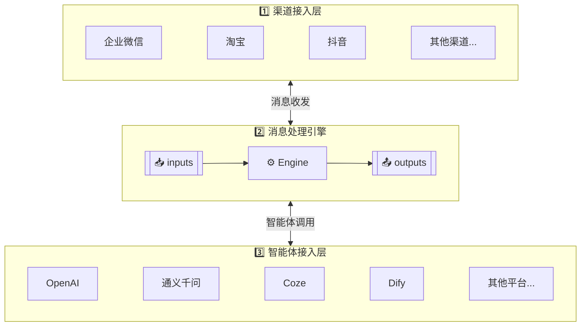
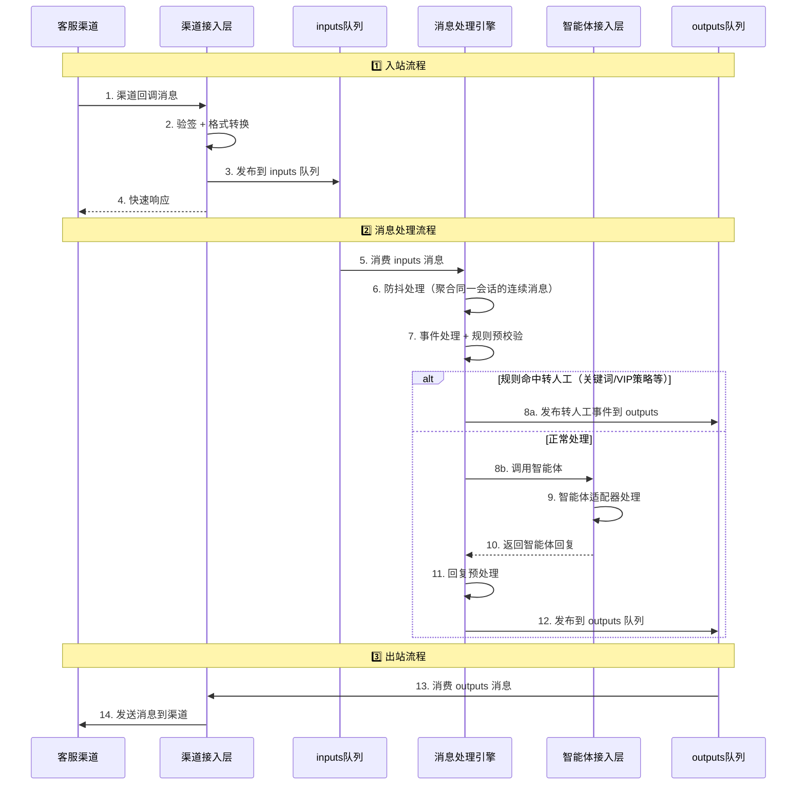
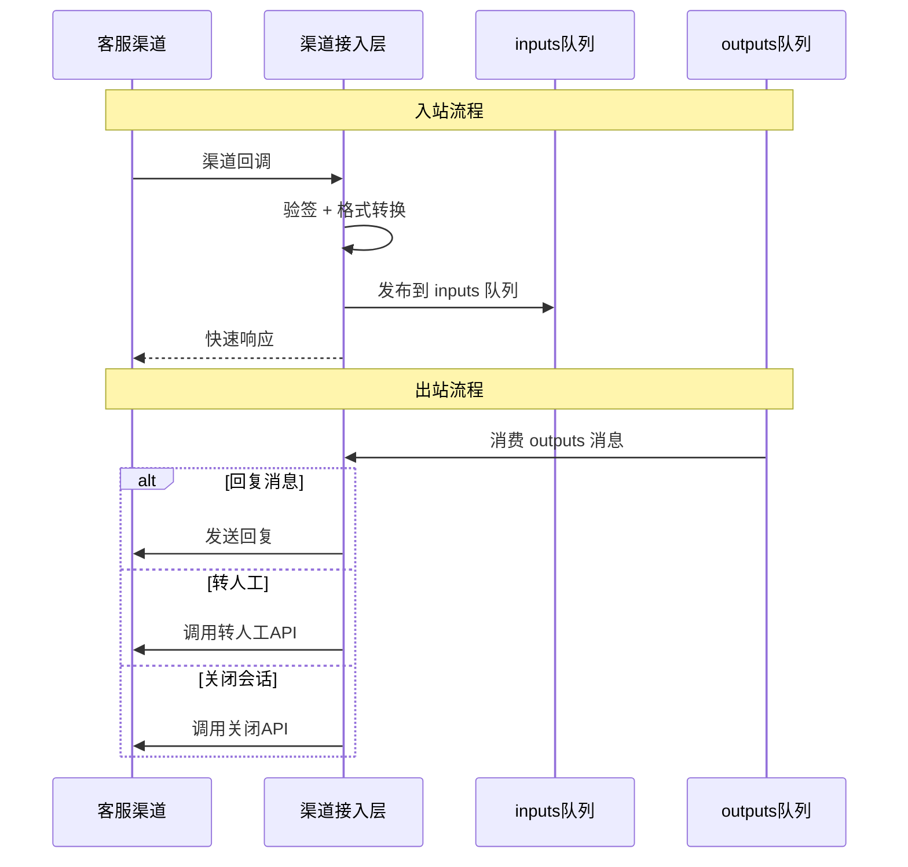
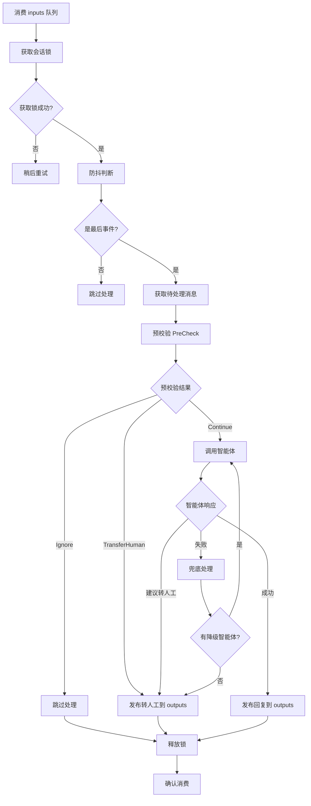
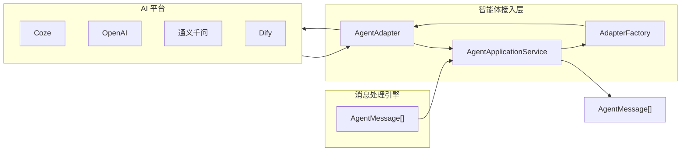
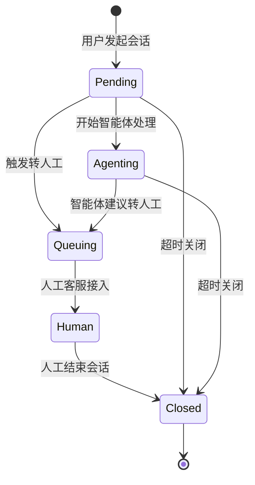
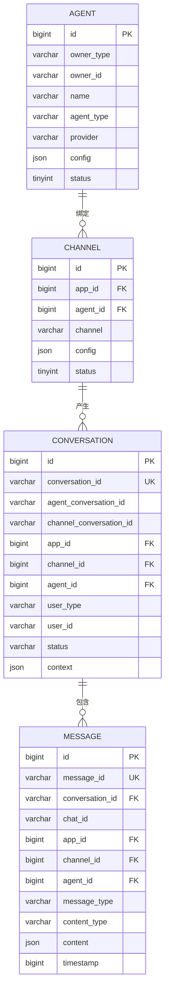

# 汇智答-智能客服平台

## 2. 项目概述

### 2.1 项目背景

随着企业多渠道运营的普及，客户服务需要同时对接企业微信、淘宝、抖音等多个平台。各平台消息格式、API接口各不相同，同时企业希望利用AI智能体来提升客服效率。

**汇智答** 旨在构建一个统一的智能客服中枢平台，实现多平台消息的统一接入、智能处理和自动回复。

> **汇智答** = **汇**聚 + **智**能 + 应**答**
>
> 汇聚智能，有问必答

### 2.2 项目目标

1. **统一接入**：对接多个主流客服渠道，将不同格式的消息转换为统一格式
2. **智能处理**：集成多种AI智能体平台，实现智能自动回复
3. **灵活扩展**：采用插件化架构，方便扩展新的平台和智能体
4. **人机协作**：支持智能体与人工客服无缝切换
5. **可视化管理**：提供管理后台进行配置和监控

### 2.3 术语定义

| 术语 | 定义 |
|------|------|
| 渠道(Channel) | 客服消息来源渠道，如企业微信、淘宝等 |
| 智能体(Agent) | AI对话处理引擎，实现统一接口，支持多种AI平台 |
| 智能体适配器(Agent Adapter) | 智能体的统一抽象接口，所有智能体实现都遵循此接口 |
| 消息处理引擎(Engine) | 核心处理组件，负责消息路由和智能体调用 |
| 消息(Message) | 用户或系统发送的单条通信内容，包含文本、图片、语音等类型 |
| 对话(Chat) | 一次消息的请求与响应交互过程 |
| 会话(Conversation) | 用户与客服之间的一次完整对话过程，包含多次对话 |
| 应用(Application) | 一个独立的客服服务实例，可配置多个渠道，每个渠道可绑定不同的智能体 |
| 回调(Callback) | 渠道主动推送消息到本系统的接口 |

---

## 3. 系统架构

### 3.1 整体架构图

系统采用 **三层架构 + 双队列驱动** 模式，通过 `inputs` 和 `outputs` 两个消息队列实现层与层之间的解耦：

### 3.2 职责划分

| 层级 | 核心职责 |
|------|----------|
| **渠道接入层 (Channel)** | 对接各客服渠道（企业微信、淘宝、抖音等），负责渠道回调接收、签名验证、消息格式转换、消息入队 (inputs)、消费输出队列 (outputs)、消息发送 |
| **消息处理引擎 (Engine)** | 核心处理层，消费 inputs 队列、事件处理、规则预校验、调用智能体、回复预处理、发布到 outputs 队列 |
| **智能体接入层 (Agent)** | 对接各 AI 平台（OpenAI、通义千问、Coze、Dify 等），提供统一的智能体适配器接口 |
| **管理端 (Admin)** | 应用管理、渠道配置、智能体配置、数据统计、系统监控 |

**双队列说明**：

| 队列 | 方向 | 作用 |
|------|------|------|
| `inputs` | 渠道层 → 引擎层 | 传递用户输入消息，触发消息处理 |
| `outputs` | 引擎层 → 渠道层 | 传递智能体回复，触发消息发送 |

### 3.3 核心处理流程

### 3.5 核心数据结构定义

#### 3.4.1 队列定义

| 队列名 | 方向 | 说明 |
|--------|------|------|
| `conversations:queue:inputs` | 渠道接入层 → 消息处理引擎 | 输入事件队列，触发消息处理（支持延时，用于防抖） |
| `conversations:queue:outputs` | 消息处理引擎 → 渠道接入层 | 输出事件队列，包含回复/转人工/状态变更消息 |
| `conversations:queue:callback` | 渠道接入层 → 消息处理引擎 | 回调处理队列 |

#### 3.4.2 Redis 存储结构

| Key 格式 | 数据结构 | 说明 |
|----------|----------|------|
| `conversations:messages:pending-input:{conversationId}` | ZSET | 待处理输入消息，score=时间戳 |
| `conversation:lock:{conversationId}` | STRING | 会话级分布式锁，防止并发处理 |
| `conversations:queue:{type}-last:{conversationId}` | STRING | 最后事件ID，用于防抖判断 |

#### 3.4.3 核心 DTO 定义

**会话数据 (ConversationData)**：

| 字段 | 类型 | 说明 |
|------|------|------|
| conversationId | string | 会话唯一ID |
| appId | int | 应用ID |
| channelId | int | 渠道ID |
| channelAppId | string? | 渠道应用ID |
| channelConversationId | string? | 渠道会话ID |
| agentConversationId | string? | 智能体会话ID |
| user | UserInterface? | 用户信息 |
| status | ConversationStatus | 会话状态 (Pending待处理/Agenting智能体处理中/Queuing人工排队中/Human人工接待/Closed已结束) |

**核心消息 (Message)**：

| 字段 | 类型 | 说明 |
|------|------|------|
| messageId | string? | 内部消息ID |
| conversationId | string? | 内部会话ID |
| chatId | string? | 内部对话ID |
| sender | UserInterface? | 发送者信息 |
| messageType | MessageType | 消息类型 (Chat/Event) |
| contentType | ContentType | 内容类型 (Text/Image/Voice/Video/File/Event/Markdown) |
| content | array? | 消息内容 |
| timestamp | int | 时间戳 |
| rawData | string? | 原始数据 |

**渠道消息 (ChannelMessage)**：继承 Message

| 字段 | 类型 | 说明 |
|------|------|------|
| appId | int? | 应用ID |
| channelId | int? | 渠道ID |
| channelAppId | string? | 渠道应用ID |
| channelConversationId | string? | 渠道会话ID |
| channelChatId | string? | 渠道聊天ID |
| channelMessageId | string? | 渠道消息ID |

**智能体消息 (AgentMessage)**：继承 Message

| 字段 | 类型 | 说明 |
|------|------|------|
| agentId | int? | 智能体ID |
| agentConversationId | string? | 智能体会话ID |
| agentChatId | string? | 智能体聊天ID |
| agentMessageId | string? | 智能体消息ID |

**会话事件 (ConversationEvent)**：用于队列消息

| 字段 | 类型 | 说明 |
|------|------|------|
| id | string | 事件唯一ID (UUID) |
| conversationId | string | 会话ID |
| queue | ConversationQueueType | 队列类型 (Inputs/Outputs/Callback) |
| timestamp | int | 时间戳 |
| delaySeconds | int? | 延时秒数（用于防抖） |

**输出队列消息 (ConversationOutputQueue)**：继承 ConversationData

| 字段 | 类型 | 说明 |
|------|------|------|
| messages | ChannelMessage[] | 待发送的消息列表 |

#### 3.4.4 MQ 抽象接口 (ConversationQueueInterface)

消息队列接口定义，支持多种实现：

| 方法 | 说明 |
|------|------|
| `publish(ConversationQueueType $queueType, Data $message, ?int $delaySeconds = null): void` | 发布消息到队列，支持延时发布 |
| `subscribe(ConversationQueueType $queueType, callable $callback): void` | 订阅队列消息 |
| `ack(mixed $message): void` | 确认消息消费 |
| `nack(mixed $message): void` | 拒绝消息，重新入队 |
| `isLastEvent(ConversationEvent $event): bool` | 判断是否为最后一个事件（用于防抖） |
| `recordLastEvent(ConversationEvent $event): void` | 记录最后一次事件ID |

**实现类**：
- `RedisQueue` - Redis List 实现
- `RedisStreamQueue` - Redis Streams 实现

---

## 4. 功能需求

### 4.1 渠道接入层 (Channel)

#### 4.1.1 概述

渠道接入层是系统的入口和出口，负责与各客服渠道的直接交互。

#### 4.1.2 核心职责

| 职责 | 说明 |
|------|------|
| **渠道回调接收** | 接收各渠道推送的客服消息 |
| **签名验证** | 验证渠道请求的合法性 |
| **消息格式转换** | 将渠道消息转为统一格式 (ChannelMessage) |
| **消息入队** | 发布事件到 inputs 队列 |
| **消费 outputs** | 消费输出队列，执行消息发送 |
| **消息发送** | 调用渠道API发送回复消息 |
| **转人工执行** | 调用渠道转人工API |

#### 4.1.3 支持渠道

- 企业微信客服
- 淘宝/天猫客服
- 抖音客服
- 自定义 API

#### 4.1.4 渠道适配器接口 (ChannelAdapterInterface)

| 方法 | 说明 |
|------|------|
| `verifySignature()` | 验证签名 |
| `extractCallbackPayload()` | 提取回调载荷 |
| `parseMessages()` | 解析消息 |
| `convertToChannelFormat()` | 转换为渠道格式 |
| `sendMessages()` | 发送消息到渠道 |
| `transferToHumanQueuing()` | 转人工排队 |
| `health()` | 健康检查 |

#### 4.1.5 处理流程

---

### 4.2 消息处理引擎 (Engine)

#### 4.2.1 概述

消息处理引擎是系统的核心处理层，负责消息的防抖聚合、预校验、智能体调用和结果发布。

#### 4.2.2 核心职责

| 职责 | 说明 |
|------|------|
| **消费 inputs 队列** | 接收渠道层发布的消息事件 |
| **防抖处理** | 聚合同一会话的连续消息 |
| **会话锁管理** | 防止并发处理同一会话 |
| **预校验** | 规则预判断（关键词转人工等） |
| **智能体调用** | 调用智能体获取回复 |
| **发布 outputs** | 将处理结果发布到输出队列 |

#### 4.2.3 核心服务

| 服务 | 说明 |
|------|------|
| **EngineCoreService** | 会话事件处理核心服务 |
| **PreCheckService** | 消息预校验服务（状态检查、关键词匹配） |
| **AgentApplicationService** | 智能体调用服务 |
| **ConversationApplicationService** | 会话管理服务 |

#### 4.2.4 预校验动作类型 (ActionType)

| 动作 | 说明 |
|------|------|
| `Continue` | 继续处理，调用智能体 |
| `Ignore` | 忽略处理（会话已转人工/已关闭） |
| `TransferHuman` | 触发转人工（关键词命中等） |

#### 4.2.5 处理流程

---

### 4.3 智能体接入层 (Agent)

#### 4.3.1 概述

智能体接入层负责对接各种 AI 平台，提供统一的智能体调用接口。

#### 4.3.2 核心职责

| 职责 | 说明 |
|------|------|
| **统一接口** | 提供 AgentAdapterInterface 统一接口 |
| **多平台对接** | 支持 OpenAI、通义千问、Coze、Dify 等平台 |
| **消息转换** | 将统一消息格式转为平台特定格式 |
| **响应解析** | 将平台响应转为统一的 AgentMessage |

#### 4.3.3 智能体适配器接口 (AgentAdapterInterface)

| 方法 | 说明 |
|------|------|
| `initialize(config)` | 初始化智能体配置 |
| `chat(request)` | 发送消息并获取回复 |
| `healthCheck()` | 健康检查 |

#### 4.3.4 支持平台

| 平台 | 说明 |
|------|------|
| **Coze** | 字节跳动智能体平台（已实现） |
| **OpenAI** | GPT-4, GPT-3.5 |
| **通义千问** | 阿里云大模型 |
| **Dify** | 开源LLM应用平台 |

#### 4.3.5 处理流程

---

### 4.4 会话管理

#### 4.4.1 会话状态

| 状态 | 英文 | 说明 |
|------|------|------|
| **待处理** | Pending | 新会话，等待处理 |
| **智能体处理中** | Agenting | 智能体正在处理 |
| **人工排队中** | Queuing | 等待人工接入 |
| **人工接待** | Human | 人工客服处理中 |
| **已结束** | Closed | 会话已关闭 |

#### 4.4.2 状态流转

---

### 4.5 管理端 (Admin)

#### 4.5.1 概述

管理端提供可视化的配置管理和数据统计功能，基于 Filament 构建。

#### 4.5.2 核心功能

| 功能模块 | 说明 |
|----------|------|
| **应用管理** | 创建和管理客服应用 |
| **渠道配置** | 配置各渠道的接入参数 |
| **智能体配置** | 配置智能体类型和参数 |
| **会话查看** | 查看会话记录和消息详情 |
| **数据统计** | 消息量、会话量、转人工率等统计 |

---

---

## 5. 数据模型

### 5.1 实体关系图

### 5.2 核心实体

#### 智能体表 (agents)

| 字段 | 类型 | 说明 |
|------|------|------|
| id | bigint | 主键 |
| owner_type | varchar(32) | 所属者类型 |
| owner_id | varchar(64) | 所属者ID |
| name | varchar(100) | 智能体名称 |
| agent_type | varchar(20) | 智能体类型 |
| provider | varchar(20) | 提供者 |
| config | json | 配置信息 |
| status | tinyint | 状态 |

#### 渠道表 (channels)

| 字段 | 类型 | 说明 |
|------|------|------|
| id | bigint | 主键 |
| app_id | bigint | 应用ID |
| agent_id | bigint | 绑定的智能体ID |
| channel | varchar(20) | 渠道类型 |
| config | json | 配置信息 |
| status | tinyint | 状态 |

#### 会话表 (conversations)

| 字段 | 类型 | 说明 |
|------|------|------|
| id | bigint | 主键 |
| conversation_id | varchar(64) | 会话ID（系统生成） |
| agent_conversation_id | varchar(128) | 智能体会话ID |
| channel_conversation_id | varchar(128) | 渠道会话ID |
| channel_app_id | varchar(128) | 渠道应用ID |
| app_id | bigint | 应用ID |
| channel_id | bigint | 渠道ID |
| agent_id | bigint | 智能体ID |
| user_type | varchar(32) | 用户类型 |
| user_id | varchar(64) | 用户ID |
| user_nickname | varchar(64) | 用户昵称 |
| status | varchar(20) | 会话状态 |
| context | json | 上下文数据 |
| transfer_reason | varchar(100) | 转接原因 |
| transfer_source | varchar(20) | 转接来源 |
| servicer | varchar(64) | 客服 |

#### 消息表 (messages)

| 字段 | 类型 | 说明 |
|------|------|------|
| id | bigint | 主键 |
| message_id | varchar(64) | 消息ID（系统生成） |
| conversation_id | varchar(64) | 会话ID |
| chat_id | varchar(64) | 对话ID |
| app_id | bigint | 应用ID |
| message_type | varchar(32) | 消息类型 |
| content_type | varchar(32) | 内容类型 |
| content | json | 消息内容 |
| sender_type | varchar(32) | 发送者类型 |
| sender_id | varchar(128) | 发送者ID |
| channel_id | bigint | 渠道ID |
| channel_message_id | varchar(128) | 渠道消息ID |
| agent_id | bigint | 智能体ID |
| agent_message_id | bigint | 智能体消息ID |
| timestamp | bigint | 消息时间戳 |

---

## 6. 附录

### 9.1 参考文档

**渠道对接**：
- [企业微信客服API文档](https://developer.work.weixin.qq.com/document/path/94638)
- [淘宝开放平台文档](https://open.taobao.com/)

**远程智能体**：
- [OpenAI API文档](https://platform.openai.com/docs/)
- [通义千问API文档](https://help.aliyun.com/document_detail/2400395.html)
- [Coze开放平台文档](https://www.coze.cn/docs/)
- [Dify文档](https://docs.dify.ai/)

**本地模型**：
- [Ollama官方文档](https://ollama.ai/)
- [llama.cpp项目](https://github.com/ggerganov/llama.cpp)
- [vLLM文档](https://docs.vllm.ai/)

