# 汇智答-智能客服平台

## 1. 文档信息

| 项目 | 内容 |
|------|------|
| 项目名称 | 汇智答 (HuiZhiDa) |
| 英文名称 | HuiZhiDa ChatBot |
| 项目代号 | HZD |
| 文档版本 | v2.3.0 |
| 创建日期 | 2026-01-20 |
| 更新日期 | 2026-01-27 |
| 文档状态 | 架构优化 |
| Slogan | 汇聚智能，有问必答 |

---

## 2. 项目概述

### 2.1 项目背景

随着企业多渠道运营的普及，客户服务需要同时对接企业微信、淘宝、抖音等多个平台。各平台消息格式、API接口各不相同，同时企业希望利用AI智能体来提升客服效率。

**汇智答** 旨在构建一个统一的智能客服中枢平台，实现多平台消息的统一接入、智能处理和自动回复。

> **汇智答** = **汇**聚 + **智**能 + 应**答**
>
> 汇聚智能，有问必答

### 2.2 项目目标

1. **统一接入**：对接多个主流客服渠道，将不同格式的消息转换为统一格式
2. **智能处理**：集成多种AI智能体平台，实现智能自动回复
3. **灵活扩展**：采用插件化架构，方便扩展新的平台和智能体
4. **人机协作**：支持智能体与人工客服无缝切换
5. **可视化管理**：提供管理后台进行配置和监控

### 2.3 术语定义

| 术语 | 定义 |
|------|------|
| 渠道(Channel) | 客服消息来源渠道，如企业微信、淘宝等 |
| 智能体(Agent) | AI对话处理引擎，实现统一接口，支持本地、远程、组合等多种模式 |
| 智能体适配器(Agent Adapter) | 智能体的统一抽象接口，所有智能体实现都遵循此接口 |
| 本地智能体(Local Agent) | 基于本地模型的智能体实现，如Ollama、llama.cpp |
| 远程智能体(Remote Agent) | 基于远程API的智能体实现，如OpenAI、通义千问、Coze |
| 组合智能体(Hybrid Agent) | 组合本地+远程的智能体实现，本地分类后路由到不同处理器 |
| 消息处理器(Processor) | 核心处理组件，负责消息路由和智能体调用 |
| 会话(Conversation) | 用户与客服之间的一次完整对话过程 |
| 应用(Application) | 一个独立的客服服务实例，可配置多个渠道，每个渠道可绑定不同的智能体 |
| 回调(Callback) | 渠道主动推送消息到本系统的接口 |

---

## 3. 系统架构

### 3.1 整体架构图

系统采用 **双队列驱动的微服务架构**，通过 `inputs` 和 `outputs` 两个消息队列实现服务解耦，按会话维度聚合消息处理：

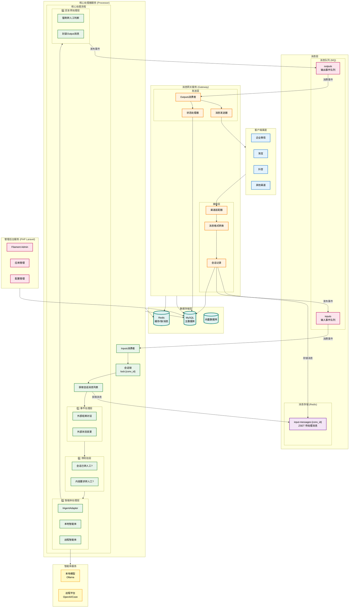

### 3.2 服务职责划分

| 服务 | 技术栈 | 核心职责 |
|------|--------|----------|
| **消息网关 (Gateway)** | PHP Laravel | 渠道回调接收、签名验证、消息格式转换、会话记录、消息入队 (inputs)、消费输出队列 (outputs)、消息发送、状态同步 |
| **核心处理器 (Processor)** | PHP Laravel | 消费输入队列 (inputs)、事件处理、规则预校验、智能体调用、回复预处理、发布到输出队列 (outputs) |
| **管理后台 (Admin)** | PHP Laravel + Filament | 应用管理、渠道配置、智能体配置、数据统计、系统监控 |

### 3.3 技术栈

| 组件 | 技术选型 | 说明 |
|------|----------|------|
| **消息网关** | PHP Laravel | 渠道适配器、消息转换、队列生产/消费 |
| **核心处理器** | PHP Laravel | 消息处理、智能体调用、业务逻辑 |
| **管理后台** | PHP Laravel + Filament | 快速开发管理界面，功能完善 |
| **消息队列** | Redis Streams / RabbitMQ | 服务间消息传递，可配置选择 |
| **消息存储** | Redis ZSET | 会话级消息聚合存储 |
| **分布式锁** | Redis | 会话级并发控制 |
| **数据库** | MySQL 8.0 | 持久化存储，事务支持 |
| **缓存** | Redis | 会话缓存、配置缓存 |
| **向量数据库** | Chroma / Milvus | FAQ语义检索，知识库 |
| **本地模型** | Ollama | 本地LLM推理 |
| **部署** | Docker + Docker Compose / K8s | 容器化部署 |

### 3.4 服务间通信

系统采用 **双队列驱动** 模式，`inputs` 队列驱动消息处理，`outputs` 队列驱动消息发送：

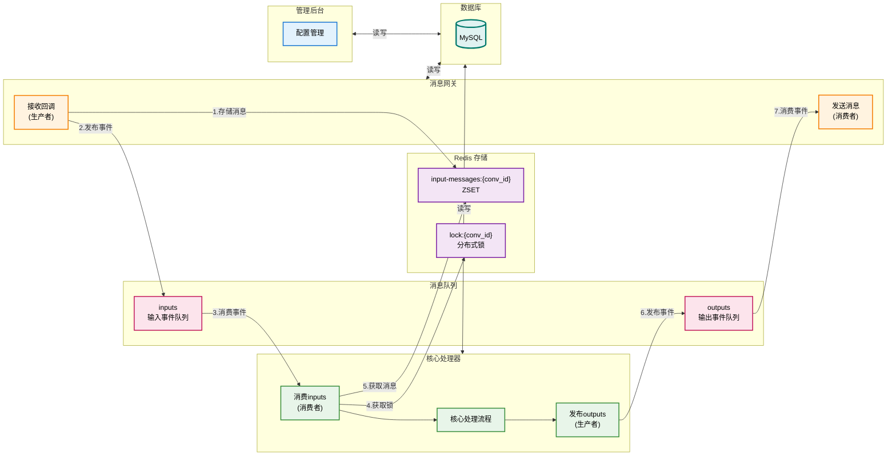

**数据流时序**：

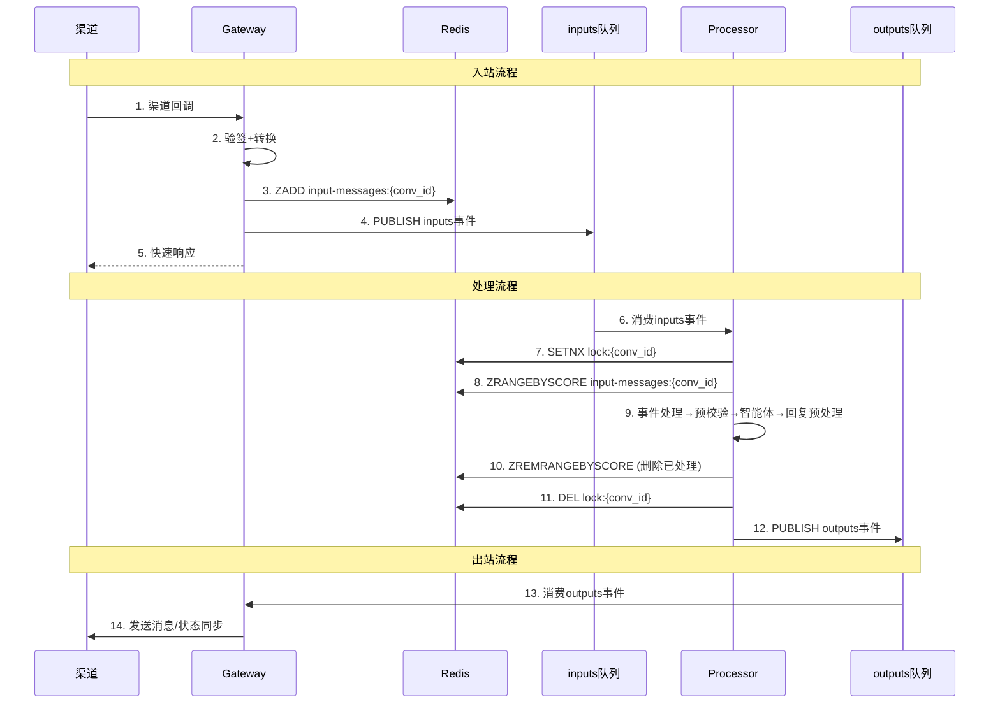

**支持的消息中间件**：

| 中间件 | 适用场景 | 说明 |
|--------|----------|------|
| **Redis Streams** | 小规模/开发测试 | 简单易用，低延迟 |
| **RabbitMQ** | 中等规模/生产环境 | 功能丰富，可靠性高 |

### 3.5 核心数据结构定义

#### 3.5.1 队列定义

| 队列名 | 方向 | 说明 |
|--------|------|------|
| `inputs` | Gateway → Processor | 输入事件通知队列，触发消息处理 |
| `outputs` | Processor → Gateway | 输出事件队列，包含完整的回复/状态变更消息 |

#### 3.5.2 Redis 存储结构

| Key格式 | 数据结构 | 说明 |
|---------|----------|------|
| `input-messages:{conversation_id}` | ZSET | 会话待处理消息集合，score=时间戳，value=消息JSON |
| `lock:conversation:{conversation_id}` | STRING | 会话处理分布式锁，防止并发处理 |

#### 3.5.3 消息 DTO 定义

**会话 DTO (ConversationDTO)**：

| 字段 | 类型 | 说明 |
|------|------|------|
| conversationId | string | 会话唯一ID |
| appId | string | 应用ID |
| channel | string | 渠道类型 (wecom/taobao/douyin) |
| channelId | string | 渠道配置ID |
| user | UserInfo | 用户信息 |
| status | string | 会话状态 (active/transferred/closed) |
| agentId | int? | 绑定智能体ID |
| context | array | 会话上下文 |
| transferReason | string? | 转人工原因 |
| transferSource | string? | 转人工来源 (rule/agent) |
| createdAt | DateTime | 创建时间 |
| updatedAt | DateTime | 更新时间 |

**消息 DTO (MessageDTO)**：

| 字段 | 类型 | 说明 |
|------|------|------|
| messageId | string | 消息唯一ID |
| conversationId | string | 会话ID |
| type | string | 消息类型 (message/event) |
| direction | string | 消息方向 (in/out) |
| messageType | string | 内容类型 (text/image/voice/event) |
| content | array | 消息内容 |
| timestamp | int | 时间戳 |
| metadata | array | 扩展元数据 |

**输入事件消息 (inputs 队列)**：

```json
{
  "type": "conversation_message",
  "conversation_id": "conv_001",
  "app_id": "app_001",
  "channel": "wecom",
  "timestamp": 1705747200000
}
```

**输出事件消息 (outputs 队列)**：

```json
{
  "type": "reply",
  "conversation_id": "conv_001",
  "channel": "wecom",
  "messages": [
    {
      "message_type": "text",
      "content": { "text": "您好，请问有什么可以帮您？" }
    }
  ],
  "timestamp": 1705747201000
}
```

```json
{
  "type": "transfer_human",
  "conversation_id": "conv_001",
  "channel": "wecom",
  "reason": "用户请求转人工",
  "source": "rule",
  "priority": "normal",
  "timestamp": 1705747201000
}
```

```json
{
  "type": "close_conversation",
  "conversation_id": "conv_001",
  "channel": "wecom",
  "reason": "会话超时",
  "timestamp": 1705747201000
}
```

#### 3.5.4 MQ 抽象接口

消息队列接口定义，支持多种实现（Redis Streams、RabbitMQ等）：

| 方法 | 说明 |
|------|------|
| `publish(string $queue, array $message): void` | 发布消息到队列 |
| `consume(string $queue, callable $handler): void` | 消费队列消息 |
| `ack(string $messageId): void` | 确认消息消费 |
| `nack(string $messageId): void` | 拒绝消息，重新入队 |

**实现类**：
- `RedisStreamQueue` - Redis Streams 实现
- `RabbitMQQueue` - RabbitMQ 实现

---

## 4. 功能需求

### 4.1 消息网关模块 (Gateway)

消息网关是系统的入口和出口服务，负责与各客服渠道的直接交互，同时消费 outputs 队列处理出站消息。

#### 4.1.1 核心职责

| 职责 | 说明 |
|------|------|
| **渠道回调接收** | 接收各渠道推送的客服消息 |
| **签名验证** | 验证渠道请求的合法性 |
| **消息格式转换** | 将渠道消息转为统一格式 (MessageDTO) |
| **会话管理** | 创建/更新会话信息 |
| **消息入队** | 将消息存入 Redis ZSET，发布事件到 inputs 队列 |
| **消费 outputs** | 消费输出队列，根据消息类型处理 |
| **消息发送** | 调用渠道API发送回复消息 |
| **状态同步** | 处理会话状态变更（转人工、关闭会话等） |

#### 4.1.2 渠道回调接收

**功能描述**：接收各渠道推送的客服消息回调

**支持渠道**：
- 企业微信客服
- 淘宝/天猫客服
- 抖音客服
- 京东客服
- 拼多多客服
- 自定义Webhook

**接口规范**：

```
POST /api/callback/{channel}/{app_id}
```

**处理流程**：

消息回调处理采用**两步处理机制**，优化连续消息的处理效率：

1. **第一步**：将消息推送到以会话ID为key的Redis ZSET中 (`input-messages:{conversation_id}`)
2. **第二步**：推送事件消息到 `inputs` 队列，触发核心处理器批量处理该会话的所有未处理消息

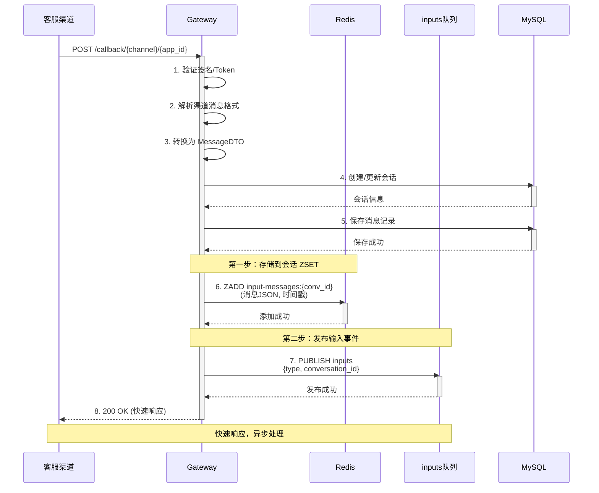

**处理步骤**：

1. 获取渠道适配器并验证签名
2. 解析并转换消息格式为统一 DTO
3. 创建/更新会话记录
4. 保存消息记录到数据库
5. 存储消息到 Redis ZSET (`input-messages:{conversation_id}`)
6. 发布输入事件到 `inputs` 队列
7. 快速响应渠道（200 OK）

#### 4.1.3 消费 outputs 队列

Gateway 负责消费 `outputs` 队列，根据消息类型执行不同的操作：

| 消息类型 | 操作 |
|----------|------|
| `reply` | 调用渠道API发送回复消息 |
| `transfer_human` | 执行转人工流程 |
| `close_conversation` | 执行关闭会话流程 |
| `state_change` | 同步会话状态到渠道 |

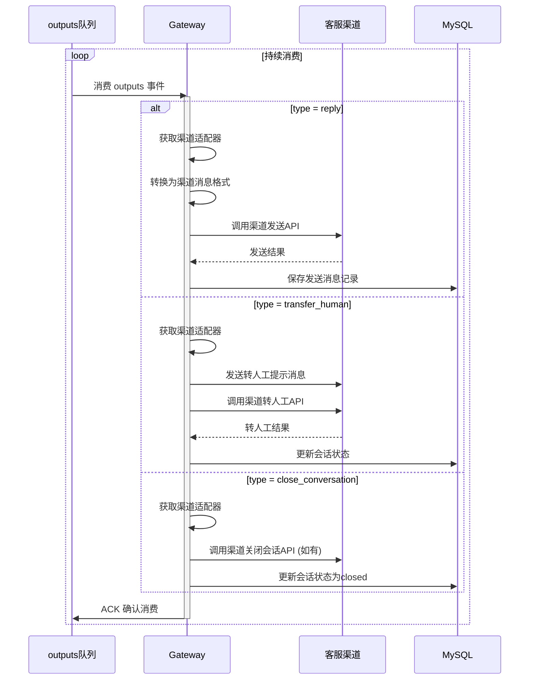

**处理逻辑**：

- **reply 类型**：转换为渠道消息格式，调用渠道API发送，保存发送记录
- **transfer_human 类型**：发送转人工提示消息，调用渠道转人工API，更新会话状态
- **close_conversation 类型**：调用渠道关闭会话API（如支持），更新会话状态为 closed

#### 4.1.5 统一消息格式

**消息结构定义**：

| 字段 | 类型 | 说明 |
|------|------|------|
| message_id | string | 消息唯一ID |
| app_id | string | 应用ID |
| channel | string | 渠道类型 |
| channel_message_id | string | 渠道消息ID |
| conversation_id | string | 会话ID |
| user | UserInfo | 用户信息 |
| message_type | string | 消息类型 |
| content | MessageContent | 消息内容 |
| timestamp | int64 | 时间戳 |
| raw_data | json? | 原始数据（可选） |

**UserInfo 结构**：

| 字段 | 类型 | 说明 |
|------|------|------|
| channel_user_id | string | 渠道用户ID |
| nickname | string | 用户昵称 |
| avatar | string | 头像URL |
| is_vip | bool | 是否VIP用户 |
| tags | []string | 用户标签 |

**MessageContent 结构**：

| 字段 | 类型 | 说明 |
|------|------|------|
| text | string? | 文本内容 |
| media_url | string? | 媒体URL |
| media_type | string? | 媒体类型 |
| extra | object? | 扩展信息 |

**JSON格式示例**：

```json
{
  "message_id": "msg_20260120_001",
  "app_id": "app_001",
  "channel": "wecom",
  "channel_message_id": "wx_msg_123456",
  "conversation_id": "conv_001",
  "user": {
    "channel_user_id": "user_wx_001",
    "nickname": "张三",
    "avatar": "https://...",
    "is_vip": false,
    "tags": ["新客户"]
  },
  "message_type": "text",
  "content": {
    "text": "你好，我想咨询一下退款流程"
  },
  "timestamp": 1705747200000
}
```

**消息类型枚举**：
- `text` - 文本消息
- `image` - 图片消息
- `voice` - 语音消息
- `video` - 视频消息
- `file` - 文件消息
- `link` - 链接消息
- `location` - 位置消息
- `event` - 事件消息（进入会话、结束会话等）

---

### 4.2 会话管理模块

#### 4.2.1 会话创建与维护

**功能描述**：管理用户与客服之间的会话状态

**会话状态**：
- `active` - 活跃中
- `pending_agent` - 等待智能体处理
- `pending_human` - 等待人工处理
- `transferred` - 已转人工
- `closed` - 已关闭

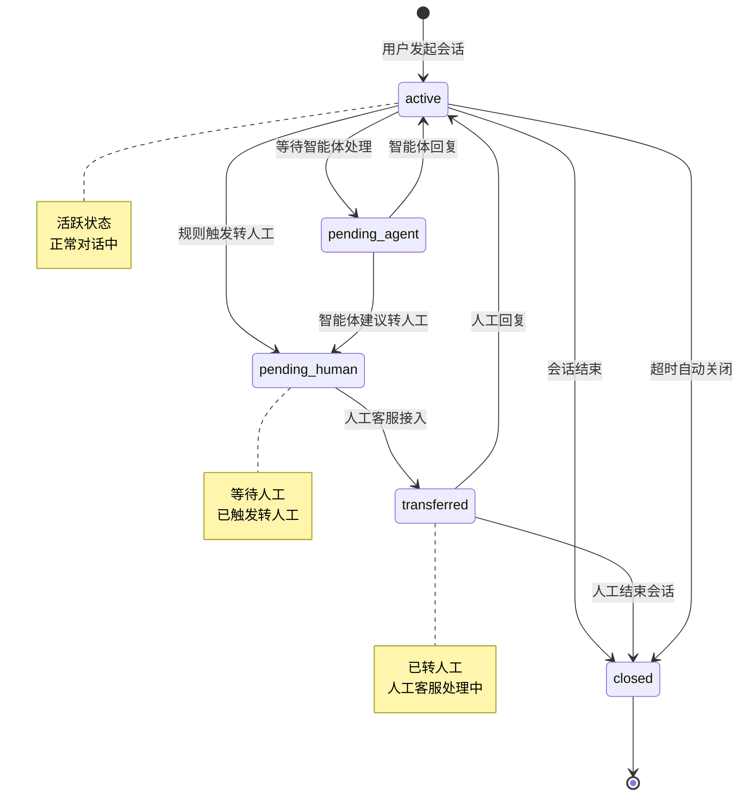

**会话数据结构**：

```json
{
  "conversation_id": "string",
  "app_id": "string",
  "channel": "string",
  "user": {
    "channel_user_id": "string",
    "nickname": "string",
    "avatar": "string",
    "is_vip": false,                // 是否VIP用户
    "tags": []                      // 用户标签
  },
  "status": "string",               // active|pending_agent|pending_human|transferred|closed
  "current_agent_id": "number",     // 当前使用的智能体ID
  "context": {
    "history": [],                  // 对话历史
    "variables": {},                // 会话变量
    "intent": "string"              // 识别的意图
  },
  "transfer_info": {                // 转人工信息（如有）
    "reason": "string",             // 转人工原因
    "source": "rule|agent",         // 触发来源
    "transfer_time": "timestamp",   // 转人工时间
    "assigned_human": "string"      // 分配的人工客服
  },
  "created_at": "timestamp",
  "updated_at": "timestamp",
  "closed_at": "timestamp"
}
```

#### 4.2.2 会话超时处理

- 会话空闲超时自动关闭（可配置，默认30分钟）
- 智能体响应超时转人工（可配置，默认10秒）
- 人工客服响应超时提醒（可配置）

---

### 4.3 核心处理器模块 (Processor)

核心处理器是系统的消息处理中枢，消费 `inputs` 队列，按会话维度批量处理消息，发布结果到 `outputs` 队列。

#### 4.3.1 功能描述

**核心职责**：
- 消费 `inputs` 队列中的事件消息
- 获取会话级分布式锁，防止并发处理
- 从 Redis ZSET 获取会话的所有未处理消息
- **1️⃣ 事件处理**：处理 event 类型消息（结束对话、状态变更等）
- **2️⃣ 预校验**：对 message 类型消息进行规则预判断
- **3️⃣ 智能体调用**：调用智能体处理消息
- **4️⃣ 回复预处理**：判断是否强制转人工
- 发布处理结果到 `outputs` 队列

#### 4.3.2 核心处理流程

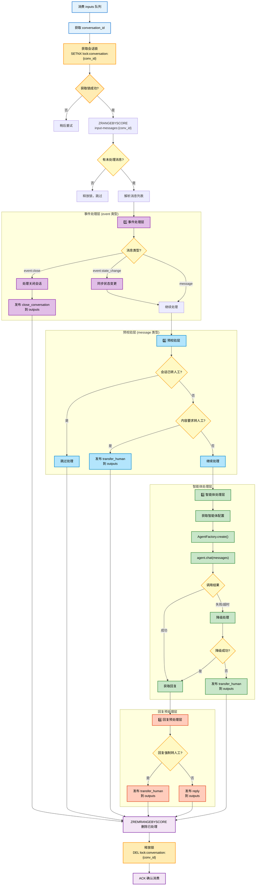

#### 4.3.3 事件处理层

处理 event 类型的消息，同步外部状态变更到内部系统：

| 事件类型 | 处理逻辑 |
|----------|----------|
| `event:close_conversation` | 外部结束对话 → 发布 close_conversation 到 outputs |
| `event:transfer_human` | 外部触发转人工 → 发布 transfer_human 到 outputs |
| `event:state_change` | 外部状态变更 → 同步更新内部会话状态 |
| `event:user_enter` | 用户进入会话 → 可选发送欢迎语 |

**处理逻辑**：

- `event:close_conversation` → 发布 `close_conversation` 到 outputs
- `event:transfer_human` → 发布 `transfer_human` 到 outputs
- `event:state_change` → 同步更新内部会话状态
- `event:user_enter` → 可选发送欢迎语

#### 4.3.4 预校验层

对 message 类型消息进行规则预判断，快速处理明确的转人工请求：

**预校验规则**：

1. **会话已转人工** → 跳过处理，等待人工
2. **关键词匹配** → 直接转人工（如"转人工"、"人工客服"等）
3. **VIP策略** → 如配置了VIP用户直接转人工，则触发转人工
4. **继续处理** → 通过预校验，继续后续智能体处理

**预校验规则配置**：

```json
{
  "pre_check_rules": {
    "transfer_keywords": ["转人工", "人工客服", "找人工", "真人客服", "投诉"],
    "vip_direct_transfer": false,
    "max_agent_retries": 2,
    "agent_timeout_seconds": 30
  }
}
```

#### 4.3.5 消息处理主流程

**处理步骤**：

1. 消费 `inputs` 队列事件
2. 获取会话级分布式锁（防止并发处理）
3. 从 Redis ZSET 获取会话的所有未处理消息
4. 执行核心处理流程（事件处理 → 预校验 → 智能体调用 → 回复预处理）
5. 发布处理结果到 `outputs` 队列
6. 删除已处理的消息
7. 释放锁并确认消费

**核心处理流程**：

- **1️⃣ 事件处理层**：先处理 event 类型消息，如关闭会话则直接返回
- **2️⃣ 预校验层**：检查会话状态、关键词匹配、VIP策略等
- **3️⃣ 智能体处理层**：调用智能体处理消息，获取回复
- **4️⃣ 回复预处理层**：判断是否强制转人工，封装 OutputEvent

#### 4.3.6 转人工处理

转人工由 Processor 生成 `transfer_human` 类型的 OutputEvent，发布到 `outputs` 队列，由 Gateway 消费并执行实际的转人工操作。

**转人工触发来源**：

| 来源 | 触发条件 | source 值 |
|------|----------|-----------|
| **规则触发** | 关键词匹配、VIP策略、会话超时 | `rule` |
| **智能体建议** | 置信度低、情绪激动、复杂问题 | `agent` |
| **外部触发** | 渠道侧触发转人工事件 | `external` |
| **异常兜底** | 智能体超时/异常 | `rule` |

**OutputEvent 结构**：

| 字段 | 类型 | 说明 |
|------|------|------|
| type | string | 事件类型 (reply/transfer_human/close_conversation) |
| conversation_id | string | 会话ID |
| channel | string | 渠道类型 |
| reason | string? | 原因（转人工/关闭会话） |
| source | string? | 触发来源 (rule/agent/external) |
| messages | array? | 回复消息列表（reply类型） |
| priority | string | 优先级 (high/normal/low) |
| timestamp | int | 时间戳 |

#### 4.3.7 异常处理与兜底

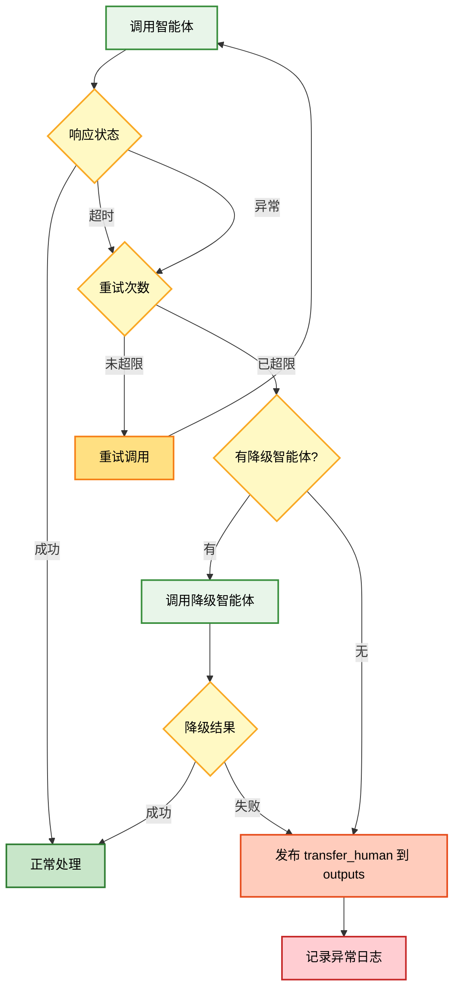

**兜底策略配置**：

```json
{
  "fallback_strategy": {
    "max_retries": 2,
    "retry_delay_ms": 500,
    "timeout_seconds": 30,
    "on_all_fail": "transfer_human",
    "fallback_message": "抱歉，系统繁忙，正在为您转接人工客服..."
  }
}
```

**异常处理策略**：

1. **主智能体调用**：带重试机制（可配置重试次数和延迟）
2. **降级智能体**：主智能体失败后，尝试调用降级智能体
3. **最终兜底**：所有尝试失败后，发布 `transfer_human` 到 outputs 队列

---

### 4.4 智能体模块

智能体层采用 **统一接口 + 多种实现** 的架构设计，所有智能体都实现同一个 `IAgentAdapter` 接口，支持本地智能体、远程智能体、组合智能体三种模式。

#### 4.4.1 智能体架构

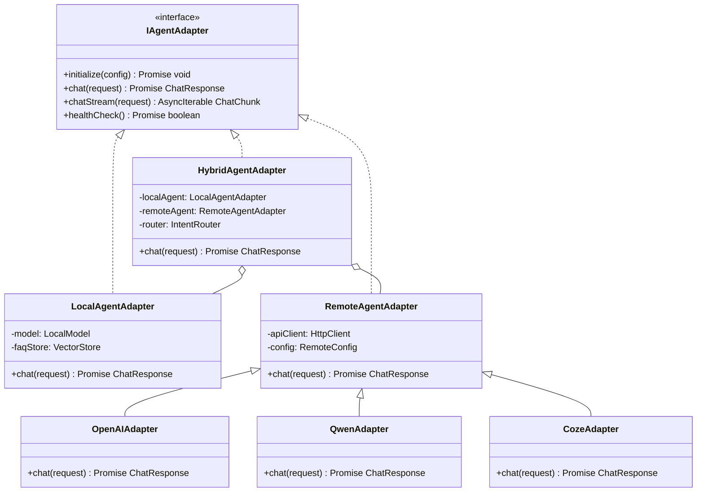

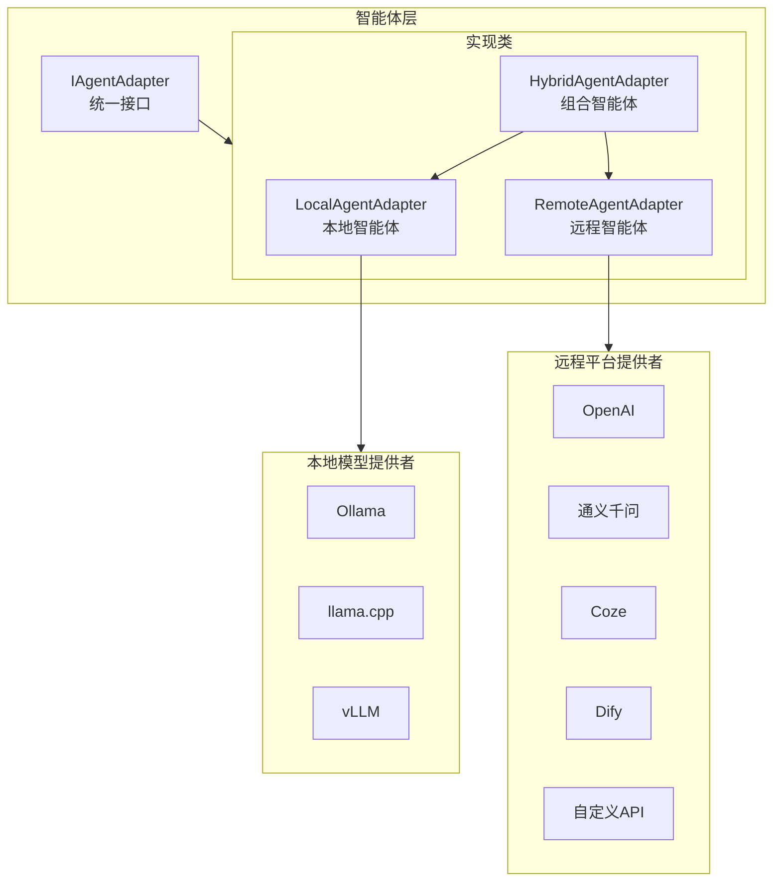

#### 4.4.2 统一接口定义

**智能体类型枚举**：
- `LOCAL` - 本地智能体
- `REMOTE` - 远程智能体
- `HYBRID` - 组合智能体

**ChatRequest 结构**：

| 字段 | 类型 | 说明 |
|------|------|------|
| conversation_id | string | 会话ID |
| message_type | string | 消息类型 (text/image/voice) |
| content | MessageContent | 消息内容 |
| history | array | 对话历史 |
| context | object | 上下文信息 |
| user_info | UserInfo | 用户信息 |
| timestamp | int | 时间戳 |

**ChatResponse 结构**：

| 字段 | 类型 | 说明 |
|------|------|------|
| reply | string | 回复内容 |
| reply_type | string | 回复类型 (text/rich) |
| rich_content | object? | 富文本内容 |
| action | object? | 需要执行的动作 |
| confidence | float | 置信度 0-1 |
| should_transfer | bool | 是否建议转人工（仅建议） |
| transfer_reason | string? | 转人工原因 |
| processed_by | string | 处理者标识 |
| metadata | object? | 扩展元数据 |

**IAgentAdapter 接口方法**：

| 方法 | 说明 |
|------|------|
| `type() -> AgentType` | 智能体类型标识 |
| `initialize(config) -> void` | 初始化配置 |
| `chat(request) -> ChatResponse` | 发送消息并获取回复 |
| `chat_stream(request) -> AsyncIterator` | 流式响应（可选实现） |
| `health_check() -> bool` | 健康检查 |
| `destroy() -> void` | 销毁/释放资源 |

#### 4.4.3 本地智能体 (LocalAgentAdapter)

**功能**：基于本地部署的模型提供智能对话能力，适合处理FAQ、简单咨询等场景。

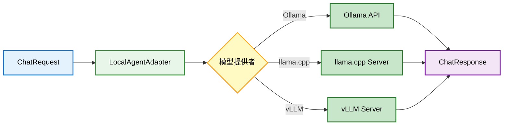

**支持的本地模型提供者**：

| 提供者 | 说明 | 适用场景 |
|--------|------|----------|
| Ollama | 本地模型服务，易于部署 | 开发/测试/小规模部署 |
| llama.cpp | C++推理引擎，性能优秀 | 高性能生产环境 |
| vLLM | 高吞吐推理服务 | 大规模并发场景 |

**配置示例**：

```json
{
  "agent_type": "local",
  "name": "本地客服助手",
  "config": {
    "provider": "ollama",
    "endpoint": "http://localhost:11434",
    "model": "qwen2:7b",
    "temperature": 0.7,
    "max_tokens": 512,
    "system_prompt": "你是一个专业的客服助手...",
    "timeout": 5000
  },
  "fallback_agent_id": "remote-openai"
}
```

#### 4.4.4 远程智能体 (RemoteAgentAdapter)

**功能**：对接远程AI平台API，获取强大的语言理解和生成能力。

**支持的远程平台**：

| 平台 | 优先级 | 说明 |
|------|--------|------|
| OpenAI | P0 | GPT-4, GPT-3.5 |
| Azure OpenAI | P0 | 企业版OpenAI |
| 通义千问 | P0 | 阿里云大模型 |
| 文心一言 | P1 | 百度大模型 |
| Coze | P1 | 字节跳动智能体平台 |
| Dify | P1 | 开源LLM应用平台 |
| 自定义HTTP | P1 | 通用HTTP接口 |

**配置示例**：

```json
{
  "agent_type": "remote",
  "name": "OpenAI GPT-4",
  "config": {
    "provider": "openai",
    "api_key": "sk-xxx",
    "api_base": "https://api.openai.com/v1",
    "model": "gpt-4",
    "temperature": 0.7,
    "max_tokens": 2000,
    "system_prompt": "你是一个专业的客服助手...",
    "timeout": 30000
  },
  "retry_config": {
    "max_retries": 3,
    "retry_delay": 1000
  }
}
```

#### 4.4.5 组合智能体 (HybridAgentAdapter)

**功能**：组合本地智能体和远程智能体，本地进行意图识别和简单问题处理，复杂问题路由到远程智能体。

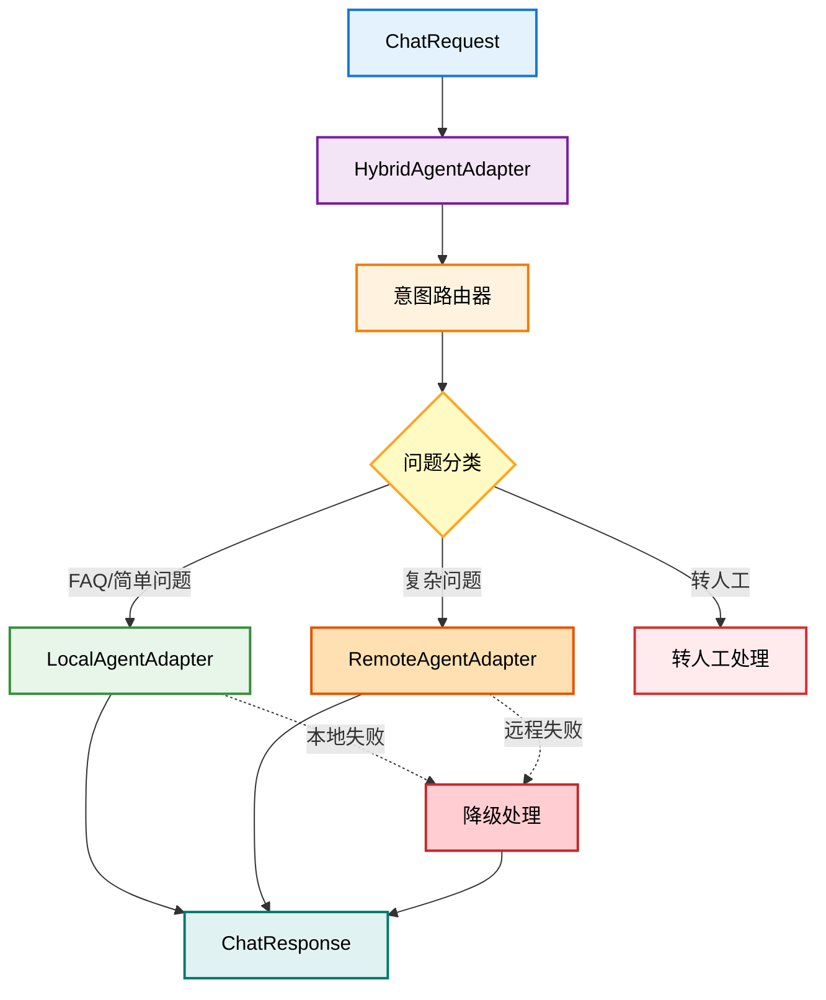

**意图分类规则**：

| 类别 | 说明 | 路由目标 |
|------|------|----------|
| `faq` | FAQ常见问题 | 本地智能体 |
| `simple_chat` | 简单对话/闲聊 | 本地智能体 |
| `product_inquiry` | 商品咨询 | 远程智能体 |
| `order_service` | 订单服务 | 远程智能体 |
| `complaint` | 投诉/复杂问题 | 远程智能体 |
| `transfer_human` | 明确要求转人工 | 转人工 |

**配置示例**：

```json
{
  "agent_type": "hybrid",
  "name": "组合客服智能体",
  "config": {
    "local_agent": {
      "provider": "ollama",
      "endpoint": "http://localhost:11434",
      "model": "qwen2:7b",
      "system_prompt": "你是一个专业的客服助手..."
    },
    "remote_agent": {
      "provider": "openai",
      "api_key": "sk-xxx",
      "model": "gpt-4",
      "system_prompt": "你是一个专业的客服助手..."
    },
    "router": {
      "type": "llm",
      "model": "qwen2:1.5b",
      "rules": [
        {
          "keywords": ["转人工", "人工客服"],
          "action": "transfer_human"
        },
        {
          "keywords": ["退款", "投诉"],
          "action": "remote"
        }
      ],
      "default_action": "local",
      "confidence_threshold": 0.8
    }
  },
  "fallback_strategy": {
    "local_fail": "remote",
    "remote_fail": "transfer_human"
  }
}
```

#### 4.4.6 智能体转人工判断

智能体在处理消息时，会根据多种因素判断是否建议转人工。**注意：智能体只返回建议，不执行转人工操作，实际执行由消息处理器推入队列，消息网关执行。**

**转人工判断逻辑**：

1. **置信度过低**：回答置信度 < 0.3 → 建议转人工
2. **负面情绪**：检测到用户情绪激动（sentiment=negative & intensity > 0.7）→ 建议转人工
3. **多轮未解决**：连续多轮对话未解决问题（unresolved_turns >= 3）→ 建议转人工
4. **复杂问题**：识别到复杂业务场景（投诉、退款纠纷等）→ 建议转人工
5. **敏感操作**：涉及需要人工确认的敏感操作 → 建议转人工

**转人工判断条件**：

| 条件 | 阈值/规则 | 原因 |
|------|----------|------|
| 置信度过低 | confidence < 0.3 | 回答可能不准确 |
| 负面情绪 | sentiment=negative & intensity > 0.7 | 用户情绪激动，需人工安抚 |
| 多轮未解决 | unresolved_turns >= 3 | 智能体无法有效解决问题 |
| 复杂问题类型 | intent in [complaint, refund_dispute...] | 需要人工判断和处理 |
| 敏感操作 | requires_human_verification = true | 涉及资金、隐私等敏感操作 |

#### 4.4.7 智能体工厂

智能体工厂根据配置创建对应的智能体实例：

**支持的远程适配器**：
- OpenAI → OpenAIAdapter
- Azure OpenAI → AzureOpenAIAdapter
- 通义千问 → QwenAdapter
- Coze → CozeAdapter
- Dify → DifyAdapter
- 自定义HTTP → CustomHttpAdapter

**创建流程**：
1. 根据 `agent_type` 判断类型（local/remote/hybrid）
2. 对于 remote 类型，根据 `provider` 创建对应的适配器
3. 初始化智能体配置
4. 返回智能体实例

#### 4.4.8 处理流程（含转人工分层协作）

```mermaid
sequenceDiagram
    participant User as 用户消息
    participant MP as 消息处理器(核心层)
    participant Factory as AgentFactory
    participant Agent as IAgentAdapter
    participant Transfer as 转人工执行
    participant Channel as 渠道API

    User->>MP: 用户消息
    activate MP
    MP->>MP: 规则预判断 preCheck()
    
    alt 关键词命中"转人工"
        MP->>Transfer: 触发转人工(source=rule)
        activate Transfer
    else 会话已转人工
        MP-->>User: 等待人工处理
    else 正常处理
        MP->>Factory: getAgent(agentId)
        activate Factory
        Factory-->>MP: agent实例
        deactivate Factory
        
        MP->>Agent: chat(request)
        activate Agent
        
        alt 调用成功
            Agent-->>MP: ChatResponse
            deactivate Agent
            
            alt should_transfer = true
                MP->>Transfer: 触发转人工(source=agent)
                activate Transfer
            else should_transfer = false
                MP-->>User: 发送回复
            end
            
        else 调用失败/超时
            deactivate Agent
            MP->>Factory: getFallbackAgent()
            activate Factory
            Factory-->>MP: fallbackAgent
            deactivate Factory
            MP->>Agent: chat(request)
            activate Agent
            
            alt 降级成功
                Agent-->>MP: ChatResponse
                deactivate Agent
                Note over MP: 检查 should_transfer
            else 降级失败
                deactivate Agent
                MP->>Transfer: 触发转人工(source=rule, reason=agent_fail)
                activate Transfer
            end
        end
    end
    
    Transfer->>Transfer: 更新会话状态
    Transfer-->>User: 发送提示消息
    Transfer->>Channel: 调用渠道转人工API
    activate Channel
    Channel-->>Transfer: 转接成功
    deactivate Channel
    deactivate Transfer
    deactivate MP

    Note over User,Channel: 分层协作，职责清晰
```

**说明**：
- **规则预判断**：核心处理层在调用智能体前进行，可快速处理明确的转人工请求
- **智能体建议**：智能体通过 `should_transfer` 返回建议，不执行转人工操作
- **统一执行**：转人工操作统一由核心处理层的 `Transfer` 模块执行

---

### 4.5 消息发送模块

#### 4.5.1 消息格式转换

**功能描述**：将智能体回复转换为目标渠道的消息格式

**转换流程**：
1. 接收统一格式的回复消息
2. 根据目标渠道获取对应适配器
3. 转换为渠道特定格式
4. 调用渠道API发送消息

#### 4.5.2 渠道发送接口

**企业微信发送**：
- 文本消息
- 图片消息
- 链接消息
- 小程序卡片

**淘宝发送**：
- 文本消息
- 图片消息
- 商品卡片
- 优惠券卡片

---

### 4.6 人工转接模块

#### 4.6.1 转接触发来源

转人工操作由 **Processor 生成 OutputEvent**，通过 `outputs` 队列传递给 **Gateway 执行**。触发来源分为三类：

| 来源类型 | 触发条件 | source 值 |
|----------|----------|-----------|
| **规则触发** | 关键词匹配、VIP策略、智能体异常 | `rule` |
| **智能体建议** | 置信度低、情绪激动、复杂问题 | `agent` |
| **外部触发** | 渠道侧推送转人工事件 | `external` |

**规则触发（Processor 预校验层）**：

| 触发条件 | 说明 |
|----------|------|
| 关键词匹配 | 用户发送"转人工"等关键词，不调用智能体 |
| 会话已转人工 | 会话状态为 transferred，跳过处理 |
| VIP策略 | 配置了VIP用户直接转人工 |
| 智能体异常 | 智能体超时/异常，兜底转人工 |

**智能体建议（智能体返回 shouldTransfer=true）**：

| 触发条件 | 说明 |
|----------|------|
| 置信度过低 | 回答置信度 < 0.3 |
| 负面情绪 | 检测到用户情绪激动 |
| 多轮未解决 | 连续多轮未解决用户问题 |
| 复杂问题 | 投诉、退款纠纷等复杂场景 |

#### 4.6.2 转接流程

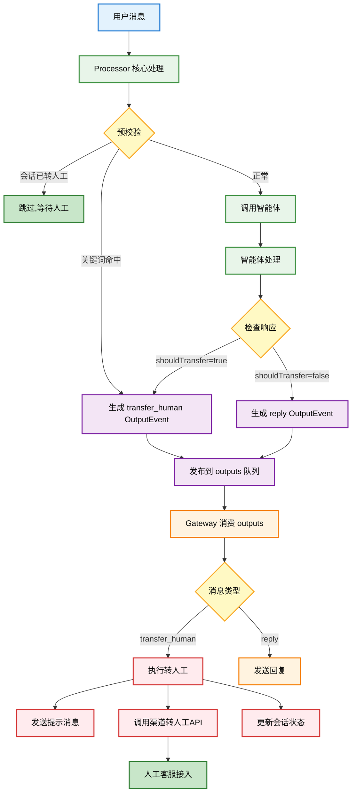

#### 4.6.3 执行转人工（Gateway）

转人工操作由 **Gateway** 消费 `outputs` 队列后执行：

**执行步骤**：

1. 发送转人工提示消息（如"正在为您转接人工客服，请稍候..."）
2. 调用渠道转人工API（传递原因、优先级等信息）
3. 更新会话状态为 `transferred`，记录转人工原因、来源、时间
4. 记录转人工日志

#### 4.6.4 各渠道转接API

| 渠道 | 转接接口 | 支持功能 |
|------|----------|----------|
| **企业微信** | 转接会话到客服 | 指定客服、技能组分配 |
| **淘宝** | 千牛转接 | 指定客服分组 |
| **抖音** | 抖店转人工 | 队列分配 |

**渠道适配器接口方法**：

| 方法 | 说明 |
|------|------|
| `transferToHuman(conversationId, options) -> void` | 转接到人工客服 |
| `supportsCloseConversation() -> bool` | 是否支持关闭会话 |
| `closeConversation(conversationId) -> void` | 关闭会话 |

---

### 4.7 管理后台模块 (PHP Laravel + Filament)

管理后台使用 **PHP Laravel + Filament** 开发，提供可视化的配置管理和数据统计功能。

#### 4.7.1 技术选型

| 组件 | 技术 | 说明 |
|------|------|------|
| 框架 | Laravel 11 | PHP 现代框架 |
| 管理面板 | Filament 3.x | 快速构建Admin界面 |
| 数据库 | MySQL 8.0 | 与其他服务共享 |
| 缓存 | Redis | 配置缓存、会话缓存 |

#### 4.7.2 Filament 资源定义

**应用管理 (ApplicationResource)**：

- 表单字段：应用名称、应用描述、绑定智能体、启用状态
- 列表字段：应用ID、应用名称、状态、创建时间

**渠道配置 (ChannelResource)**：

- 表单字段：所属应用、渠道类型（企业微信/淘宝/抖音等）
- 根据渠道类型动态显示配置项：
  - 企业微信：企业ID、应用Secret、回调Token、加密Key
  - 淘宝：App Key、App Secret、Session Key

**智能体管理 (AgentResource)**：

- 表单字段：智能体名称、所属人、智能体类型
- 根据智能体类型动态显示配置：
  - 本地智能体：提供者（Ollama/llama.cpp/vLLM）、服务地址、模型名称
  - 远程智能体：提供者（OpenAI/Azure/通义千问/Coze/Dify）、API Key、API Base URL、模型
  - 通用配置：系统提示词、Temperature、Max Tokens、降级智能体

#### 4.7.3 数据统计仪表板

**统计指标**：

- 今日消息数（含趋势图表）
- 活跃会话数
- 智能体处理率
- 转人工率

**统计维度**：
- 消息总量（按时间段）
- 会话数量（按状态）
- 智能体处理量（按类型）
- 人工转接率
- 平均响应时间
- 用户满意度

**统计周期**：实时 / 小时 / 日 / 周 / 月

---

## 5. 非功能需求

### 5.1 性能要求

| 指标 | 要求 |
|------|------|
| 消息接收延迟 | < 100ms（接收到转发） |
| 本地智能体响应 | < 1s（P95） |
| 远程智能体响应 | < 5s（P95） |
| 组合智能体响应 | < 2s（本地分类+处理，P95） |
| 消息发送延迟 | < 200ms |
| 系统吞吐量 | > 1000 msg/s |
| 并发会话数 | > 10000 |

### 5.2 可用性要求

- 系统可用性：99.9%
- 数据持久化：消息不丢失
- 故障恢复：自动重试机制
- 降级策略：智能体不可用时自动转人工

### 5.3 安全要求

- 数据传输：HTTPS加密
- 敏感数据：加密存储（API密钥等）
- 访问控制：基于角色的权限管理
- 审计日志：操作日志记录
- 渠道验签：验证回调请求合法性

### 5.4 扩展性要求

- 新渠道接入：实现适配器接口即可
- 新智能体接入：实现智能体接口即可
- 水平扩展：支持多实例部署
- 配置热更新：无需重启更新配置

---

## 6. 接口设计

### 6.1 回调接口

#### 6.1.1 企业微信回调

```
POST /api/callback/wecom/{app_id}
```

#### 6.1.2 淘宝回调

```
POST /api/callback/taobao/{app_id}
```

### 6.2 管理接口

#### 6.2.1 应用管理

```
POST   /api/admin/apps              # 创建应用
GET    /api/admin/apps              # 应用列表
GET    /api/admin/apps/{app_id}     # 应用详情
PUT    /api/admin/apps/{app_id}     # 更新应用
DELETE /api/admin/apps/{app_id}     # 删除应用
```

#### 6.2.2 渠道配置

```
POST   /api/admin/apps/{app_id}/channels            # 添加渠道
GET    /api/admin/apps/{app_id}/channels            # 渠道列表
PUT    /api/admin/apps/{app_id}/channels/{id}       # 更新渠道配置
DELETE /api/admin/apps/{app_id}/channels/{id}       # 删除渠道
```

#### 6.2.3 智能体管理

```
POST   /api/admin/agents                            # 创建智能体
GET    /api/admin/agents                            # 智能体列表
GET    /api/admin/agents/{id}                       # 智能体详情
PUT    /api/admin/agents/{id}                       # 更新智能体
DELETE /api/admin/agents/{id}                       # 删除智能体
```

### 6.3 数据接口

```
GET /api/admin/stats/overview                       # 总览统计
GET /api/admin/stats/messages                       # 消息统计
GET /api/admin/stats/conversations                  # 会话统计
GET /api/admin/conversations                        # 会话列表
GET /api/admin/conversations/{conversation_id}      # 会话详情
GET /api/admin/conversations/{conversation_id}/messages  # 会话消息记录
```

---

## 7. 数据模型

### 7.1 实体关系图

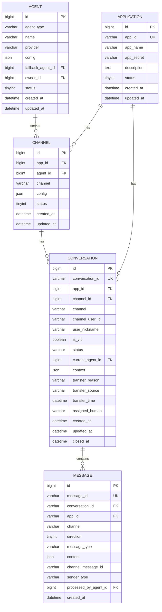

### 7.2 核心实体

#### 智能体表 (agents)

| 字段 | 类型 | 说明 |
|------|------|------|
| id | bigint | 主键 |
| agent_type | varchar(20) | 智能体类型(local/remote/hybrid) |
| name | varchar(100) | 名称 |
| provider | varchar(20) | 提供者(ollama/openai/qwen/coze等) |
| config | json | 配置信息(加密) |
| fallback_agent_id | bigint | 降级智能体ID |
| owner_id | bigint | 所属人ID |
| status | tinyint | 状态 |
| created_at | datetime | 创建时间 |
| updated_at | datetime | 更新时间 |

#### 应用表 (applications)

| 字段 | 类型 | 说明 |
|------|------|------|
| id | bigint | 主键 |
| app_id | varchar(32) | 应用ID |
| app_name | varchar(100) | 应用名称 |
| app_secret | varchar(64) | 应用密钥 |
| description | text | 描述 |
| agent_id | bigint | 绑定的智能体ID |
| status | tinyint | 状态 |
| created_at | datetime | 创建时间 |
| updated_at | datetime | 更新时间 |

#### 渠道表 (channels)

| 字段 | 类型 | 说明 |
|------|------|------|
| id | bigint | 主键 |
| app_id | varchar(32) | 应用ID |
| channel | varchar(20) | 渠道类型 |
| config | json | 配置信息(加密) |
| status | tinyint | 状态 |
| created_at | datetime | 创建时间 |
| updated_at | datetime | 更新时间 |

#### 会话表 (conversations)

| 字段 | 类型 | 说明 |
|------|------|------|
| id | bigint | 主键 |
| conversation_id | varchar(64) | 会话ID |
| app_id | varchar(32) | 应用ID |
| channel | varchar(20) | 渠道 |
| channel_user_id | varchar(64) | 渠道用户ID |
| user_nickname | varchar(100) | 用户昵称 |
| is_vip | boolean | 是否VIP用户 |
| status | varchar(20) | 会话状态 |
| current_agent_id | bigint | 当前使用的智能体ID |
| context | json | 会话上下文 |
| transfer_reason | varchar(100) | 转人工原因 |
| transfer_source | varchar(20) | 转人工来源(rule/agent) |
| transfer_time | datetime | 转人工时间 |
| assigned_human | varchar(64) | 分配的人工客服ID |
| created_at | datetime | 创建时间 |
| updated_at | datetime | 更新时间 |
| closed_at | datetime | 关闭时间 |

#### 消息表 (messages)

| 字段 | 类型 | 说明 |
|------|------|------|
| id | bigint | 主键 |
| message_id | varchar(64) | 消息ID |
| conversation_id | varchar(64) | 会话ID |
| app_id | varchar(32) | 应用ID |
| channel | varchar(20) | 渠道 |
| direction | tinyint | 方向(1:收 2:发) |
| message_type | varchar(20) | 消息类型 |
| content | json | 消息内容 |
| channel_message_id | varchar(64) | 渠道消息ID |
| sender_type | varchar(20) | 发送者类型(user/agent/human) |
| processed_by_agent_id | bigint | 处理智能体ID |
| created_at | datetime | 创建时间 |

---

## 8. 部署架构

### 8.1 单机部署 (Docker Compose)

适用于开发测试和小规模使用：

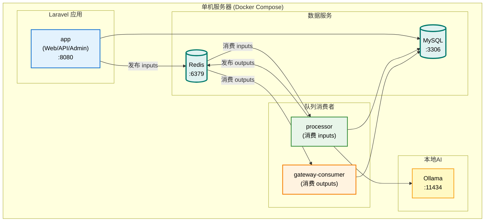

**docker-compose.yml 示例**：

```yaml
version: '3.8'

services:
  # Laravel 应用 (Web + API + Admin)
  app:
    build:
      context: ./admin
      dockerfile: Dockerfile
    ports:
      - "8080:80"
    environment:
      - APP_ENV=local
      - APP_DEBUG=true
      - DB_CONNECTION=mysql
      - DB_HOST=mysql
      - DB_PORT=3306
      - DB_DATABASE=huizhida
      - DB_USERNAME=root
      - DB_PASSWORD=password
      - REDIS_HOST=redis
      - REDIS_PORT=6379
      - QUEUE_CONNECTION=redis
      - OLLAMA_HOST=http://ollama:11434
    volumes:
      - ./admin:/var/www/html
    depends_on:
      - mysql
      - redis

  # Processor 队列消费者 (消费 inputs 队列)
  processor:
    build:
      context: ./admin
      dockerfile: Dockerfile
    command: php artisan queue:process-inputs
    environment:
      - APP_ENV=local
      - DB_HOST=mysql
      - DB_DATABASE=huizhida
      - DB_USERNAME=root
      - DB_PASSWORD=password
      - REDIS_HOST=redis
      - OLLAMA_HOST=http://ollama:11434
    volumes:
      - ./admin:/var/www/html
    depends_on:
      - mysql
      - redis
      - ollama
    deploy:
      replicas: 2  # 可根据负载调整

  # Gateway 队列消费者 (消费 outputs 队列)
  gateway-consumer:
    build:
      context: ./admin
      dockerfile: Dockerfile
    command: php artisan queue:consume-outputs
    environment:
      - APP_ENV=local
      - DB_HOST=mysql
      - DB_DATABASE=huizhida
      - DB_USERNAME=root
      - DB_PASSWORD=password
      - REDIS_HOST=redis
    volumes:
      - ./admin:/var/www/html
    depends_on:
      - mysql
      - redis
    deploy:
      replicas: 2  # 可根据负载调整

  # Ollama 本地模型
  ollama:
    image: ollama/ollama:latest
    ports:
      - "11434:11434"
    volumes:
      - ollama_data:/root/.ollama
    # GPU支持 (可选)
    # deploy:
    #   resources:
    #     reservations:
    #       devices:
    #         - capabilities: [gpu]

  mysql:
    image: mysql:8.0
    environment:
      - MYSQL_ROOT_PASSWORD=password
      - MYSQL_DATABASE=huizhida
    volumes:
      - mysql_data:/var/lib/mysql
    ports:
      - "3306:3306"

  redis:
    image: redis:7-alpine
    ports:
      - "6379:6379"
    volumes:
      - redis_data:/data

volumes:
  mysql_data:
  redis_data:
  ollama_data:
```

**服务说明**：

| 服务 | 说明 | 扩容方式 |
|------|------|----------|
| `app` | Laravel 主应用，处理 HTTP 请求（回调、管理后台） | 水平扩展 |
| `processor` | 消费 inputs 队列，处理消息 | 增加 replicas |
| `gateway-consumer` | 消费 outputs 队列，发送消息 | 增加 replicas |
| `ollama` | 本地 LLM 推理服务 | 需 GPU 支持 |

### 8.2 集群部署 (Kubernetes)

适用于生产环境：

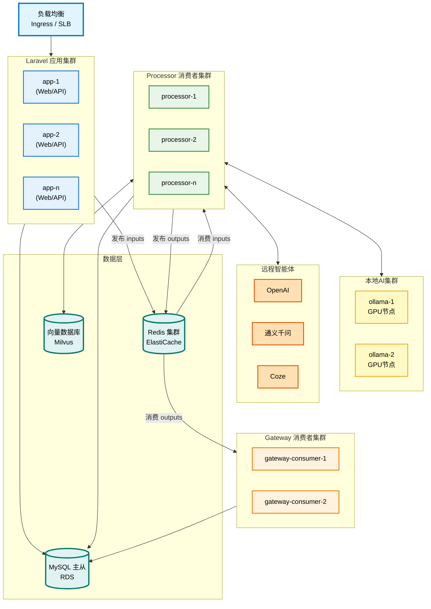

### 8.3 服务扩缩容策略

| 服务 | 扩容条件 | 缩容条件 | 说明 |
|------|----------|----------|------|
| **app** (Laravel Web) | CPU > 70% 或 QPS > 1000 | CPU < 30% | 无状态，可水平扩展 |
| **processor** (inputs消费者) | inputs 队列积压 > 1000 | 队列空闲 | 按消费能力扩展 |
| **gateway-consumer** (outputs消费者) | outputs 队列积压 > 500 | 队列空闲 | 一般 2-4 副本即可 |
| **ollama** | GPU利用率 > 80% | - | 需 GPU 节点 |

**队列监控指标**：

| 指标 | 告警阈值 | 说明 |
|------|----------|------|
| `inputs` 队列长度 | > 1000 | 需扩容 processor |
| `outputs` 队列长度 | > 500 | 需扩容 gateway-consumer |
| 消息处理延迟 | > 5s | 检查智能体响应时间 |
| 消息发送失败率 | > 1% | 检查渠道 API 状态 |

### 8.4 项目目录结构

系统采用 **PHP Laravel Monorepo** 架构，通过 packages 实现模块化：

```
huizhida-chatbot/               # 汇智答
├── admin/                      # Laravel 主应用
│   ├── app/
│   │   ├── Filament/          # Filament 管理后台
│   │   │   ├── Resources/     # Filament资源
│   │   │   │   ├── ApplicationResource.php
│   │   │   │   ├── ChannelResource.php
│   │   │   │   └── AgentResource.php
│   │   │   └── Widgets/       # 仪表板组件
│   │   ├── Console/
│   │   │   └── Commands/      # 队列消费命令
│   │   ├── Models/            # Eloquent 模型
│   │   └── Providers/
│   │
│   ├── packages/              # 模块化包
│   │   │
│   │   ├── core/              # 核心包 - 共享DTO、接口、模型
│   │   │   ├── src/
│   │   │   │   ├── Domain/
│   │   │   │   │   ├── Conversation/
│   │   │   │   │   │   ├── DTO/
│   │   │   │   │   │   │   ├── ConversationDTO.php
│   │   │   │   │   │   │   ├── MessageDTO.php
│   │   │   │   │   │   │   └── ChannelMessage.php
│   │   │   │   │   │   ├── Contracts/
│   │   │   │   │   │   │   └── ConversationQueueInterface.php
│   │   │   │   │   │   └── Models/
│   │   │   │   │   └── Agent/
│   │   │   │   │       └── Contracts/
│   │   │   │   │           └── AgentAdapterInterface.php
│   │   │   │   └── Infrastructure/
│   │   │   │       └── Queue/
│   │   │   │           ├── RedisStreamQueue.php
│   │   │   │           └── RabbitMQQueue.php
│   │   │   └── composer.json
│   │   │
│   │   ├── gateway/           # 消息网关包
│   │   │   ├── src/
│   │   │   │   ├── Domain/
│   │   │   │   │   └── Contracts/
│   │   │   │   │       └── ChannelAdapterInterface.php
│   │   │   │   ├── Application/
│   │   │   │   │   └── Services/
│   │   │   │   │       └── CallbackService.php
│   │   │   │   ├── Infrastructure/
│   │   │   │   │   └── Adapters/
│   │   │   │   │       ├── WeComAdapter.php
│   │   │   │   │       ├── TaobaoAdapter.php
│   │   │   │   │       ├── DouyinAdapter.php
│   │   │   │   │       └── ChannelAdapterFactory.php
│   │   │   │   ├── Http/
│   │   │   │   │   └── Controllers/
│   │   │   │   │       └── CallbackController.php
│   │   │   │   └── Console/
│   │   │   │       └── Commands/
│   │   │   │           └── ConsumeOutputsCommand.php
│   │   │   ├── routes/
│   │   │   │   └── api.php
│   │   │   └── composer.json
│   │   │
│   │   └── agent-processor/   # 核心处理器包
│   │       ├── src/
│   │       │   ├── Domain/
│   │       │   │   ├── Contracts/
│   │       │   │   │   └── AgentAdapterInterface.php
│   │       │   │   └── Events/
│   │       │   │       └── OutputEvent.php
│   │       │   ├── Application/
│   │       │   │   └── Services/
│   │       │   │       ├── MessageProcessorService.php
│   │       │   │       ├── EventHandler.php
│   │       │   │       ├── PreCheckService.php
│   │       │   │       └── AgentInvoker.php
│   │       │   ├── Infrastructure/
│   │       │   │   └── Agents/
│   │       │   │       ├── LocalAgentAdapter.php
│   │       │   │       ├── RemoteAgentAdapter.php
│   │       │   │       ├── OpenAIAdapter.php
│   │       │   │       ├── CozeAdapter.php
│   │       │   │       └── AgentFactory.php
│   │       │   └── Console/
│   │       │       └── Commands/
│   │       │           └── ProcessConversationEventsCommand.php
│   │       └── composer.json
│   │
│   ├── config/
│   ├── database/
│   │   └── migrations/
│   ├── routes/
│   ├── resources/
│   ├── tests/
│   ├── composer.json
│   └── Dockerfile
│
├── docs/                       # 文档
│   └── requirements.md
├── docker-compose.yml          # 本地开发
├── docker-compose.prod.yml     # 生产部署
└── README.md
```

**包依赖关系**：

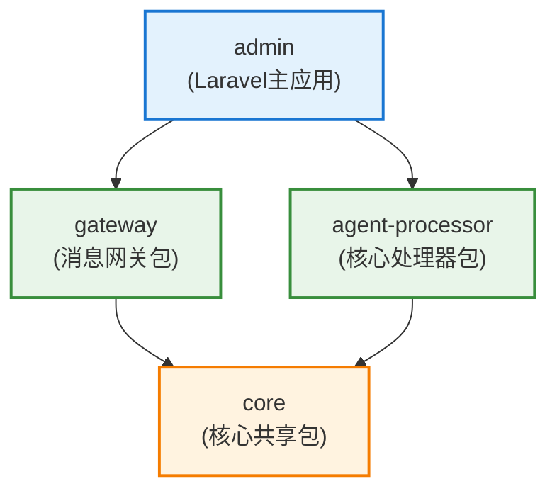

---

## 9. 附录

### 9.1 参考文档

**渠道对接**：
- [企业微信客服API文档](https://developer.work.weixin.qq.com/document/path/94638)
- [淘宝开放平台文档](https://open.taobao.com/)

**远程智能体**：
- [OpenAI API文档](https://platform.openai.com/docs/)
- [通义千问API文档](https://help.aliyun.com/document_detail/2400395.html)
- [Coze开放平台文档](https://www.coze.cn/docs/)
- [Dify文档](https://docs.dify.ai/)

**本地模型**：
- [Ollama官方文档](https://ollama.ai/)
- [llama.cpp项目](https://github.com/ggerganov/llama.cpp)
- [vLLM文档](https://docs.vllm.ai/)

